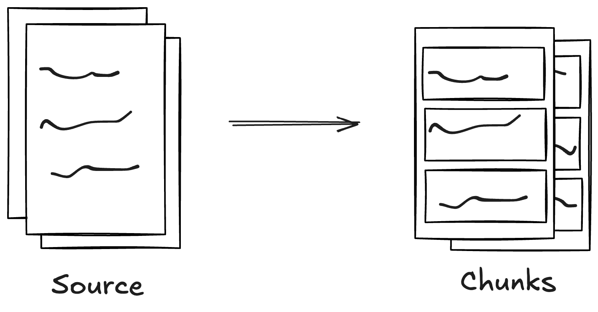
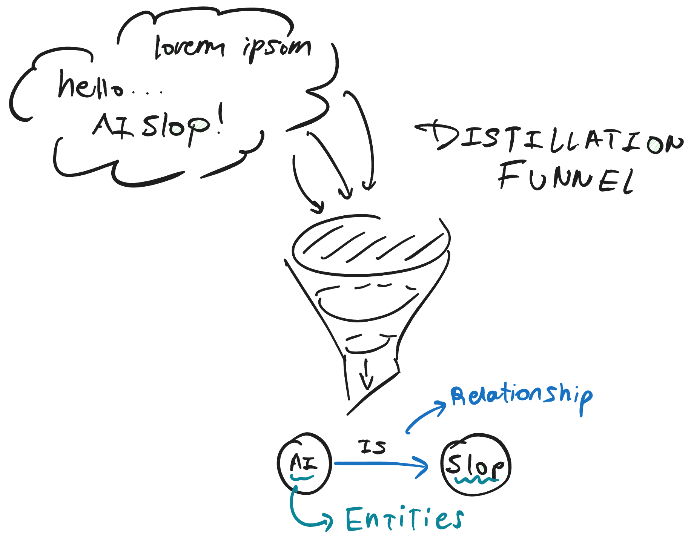
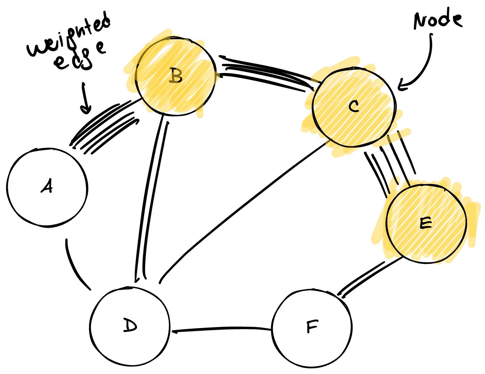
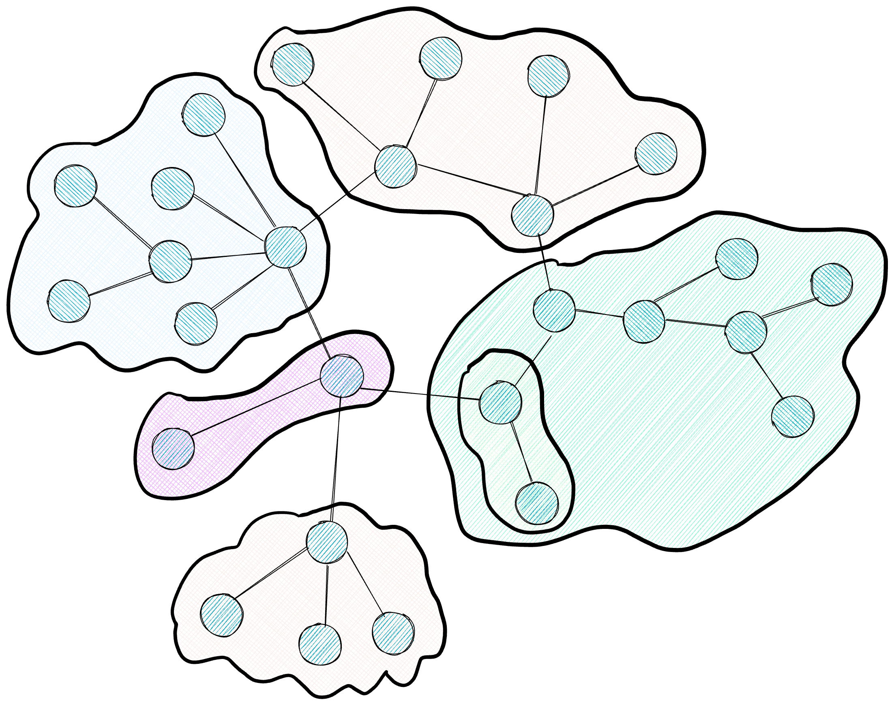
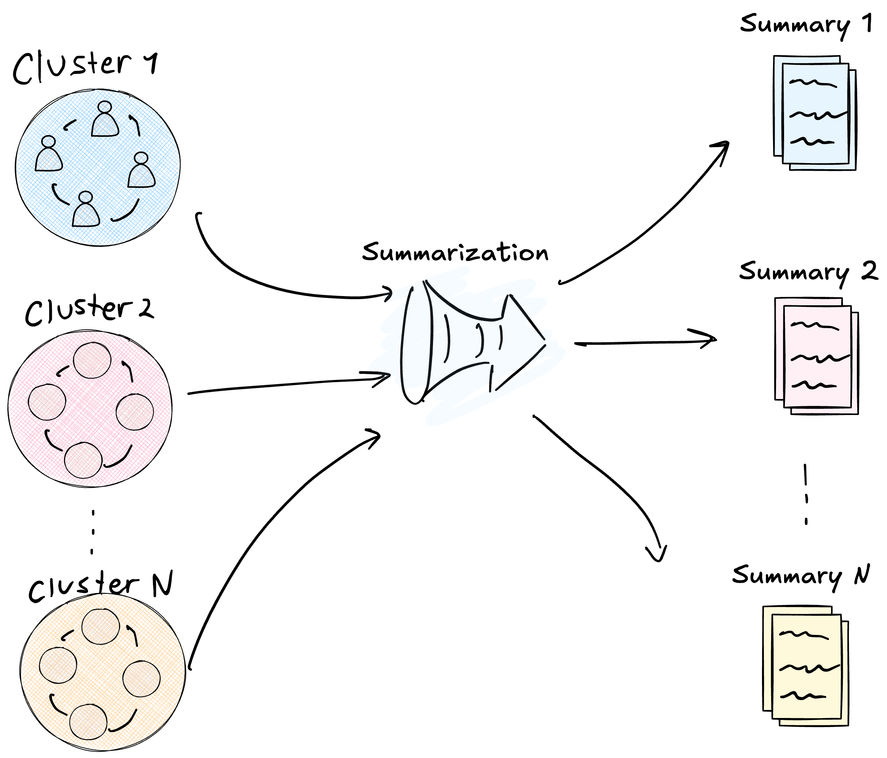
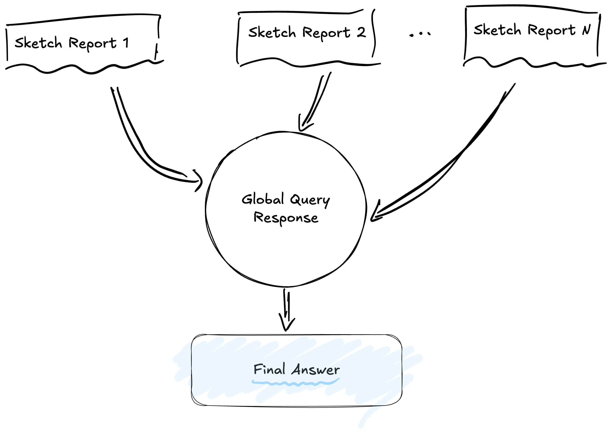

RAG (*Retrieval-Augmented Generation*) has established itself as the industry standard for mitigating hallucinations in Large Language Models (LLMs) by injecting reliable data during response generation. The mechanism is well-known: given a query, the system retrieves relevant text fragments ("chunks") from a vector database and passes them as context to the model to formulate a grounded answer. This approach involves retrieving specific data points for targeted questions. However, its performance degrades significantly when the task requires a transversal understanding of an entire corpus, such as answering *"What are the patterns of technological evolution in these 10,000 reports?"*. Vector similarity retrieval, by delivering isolated pieces, lacks the architecture necessary to synthesize a global overview.

**GraphRAG**, presented by Microsoft Research in the paper *["From Local to Global: A GraphRAG Approach to Query-Focused Summarization"](https://arxiv.org/pdf/2404.16130)*, addresses this limitation by proposing a different strategy: structuring information into a hierarchical knowledge graph before receiving any query. This comprehensive indexing process transforms source documents into a network of entities and relationships, grouped into thematic communities, each with its own generated summary. Thus, when a global question arrives, the system already possesses a navigatable semantic map of the corpus.

Below, we analyze the six stages of this pipeline, explaining how each feeds into the next and why the whole is more powerful than the sum of its parts.

---

## The Indexing Pipeline

The heart of GraphRAG lies in its indexing phase. Unlike a traditional RAG system, where computational investment is concentrated at query time, GraphRAG performs heavy lifting beforehand to facilitate subsequent responses. This work consists of building, from raw documents, a hierarchical knowledge structure that enables reasoning about the dataset transversally.

### Stage 1: Text Segmentation

The process begins by converting source documents into processable text units, or chunks. The decision on the size of these fragments is a critical engineering variable, as it affects both cost (number of LLM calls) and the quality of subsequent extraction. GraphRAG recommends fragments of approximately 600 tokens, a size that balances local context retention with processing efficiency.

The diagram represents the transformation of the original document into multiple fragments. The division respects, as much as possible, the semantic boundaries of the text, avoiding cutting sentences or paragraphs in half.

A fundamental aspect of this segmentation is the overlap between fragments. By repeating approximately 100 tokens between the end of one chunk and the beginning of the next, the system generates semantic continuity. This overlap ensures that relationships crossing the boundaries of a fragment (for example, a mention of "the previously mentioned company") are not orphaned of context. Thus, when the LLM analyzes each chunk in isolation in the next stage, it will have the necessary information to correctly interpret internal text references.

### Stage 2: Element Extraction

Once the corpus is segmented, each chunk is processed by an LLM with the objective of extracting three types of structured elements: entities (which will be the graph nodes), relationships (which will be the edges), and claims (factual statements that anchor knowledge to the source).

The figure illustrates this distillation process. Text fragments enter the model and emerge as structured components: icons representing classified entities (Person, Organization, Event, Technology) and arrows describing relationships between them ("works_in", "developed_by", "collaborates_with").

The prompt used for this extraction is multipartite: it instructs the model to identify entities, classify them into predefined categories, and explicitly describe the nature of their links. To maximize coverage, GraphRAG implements a "gleaning" technique: after the first extraction pass, the system executes a *continuation prompt* asking the model if any elements were missed. This additional iteration significantly reduces information loss.

The quality of this process improves substantially when using *few-shot* prompts adapted to the specific domain. Injecting examples of correct extraction (for example, from financial reports or biomedical papers) biases the model towards the type of entities and relationships relevant to the corpus. Furthermore, extracting "claims" allows preserving the original factual context: each relationship is anchored to a quote from the source text, with a date if available, facilitating subsequent verification and reducing hallucination risk.

### Stage 3: Graph Construction

With thousands of extracted entities and relationships, the system faces a consolidation challenge: the same entity might be mentioned with different variants (for example, "John Doe", "J. Doe", and "Engineer Doe" might refer to the same person). GraphRAG applies entity resolution algorithms to fuse these duplicate mentions into a single canonical node, thus creating a unified and coherent multigraph.

In the diagram, the consolidated network is observed. Larger nodes (in orange) represent entities with high centrality—those participating in multiple relationships and acting as information hubs. Thicker lines indicate relationships detected in multiple instances across the corpus.

This edge thickness corresponds to the concept of weighted edges. Every time the system detects a relationship between two entities in different parts of the corpus, it increments the weight of the corresponding edge. A relationship mentioned fifty times will have a substantially higher weight than one mentioned only once. This weighting transforms the graph into a relevance heat map: it allows distinguishing deep structural links (those traversing multiple documents and contexts) from anecdotal connections appearing in isolation. This relationship intensity will be the primary input for the community detection algorithm that follows, as it indicates which nodes should be grouped together.

### Stage 4: Community Detection

The resulting graph from the previous stage can contain thousands or millions of nodes, a scale exceeding the capacity of any LLM context window. To organize this information navigably, GraphRAG applies the Leiden algorithm, a community detection method that groups nodes into clusters based on the density of their connections.

The diagram shows the resulting hierarchy: clusters of different colors group densely connected nodes, with dotted lines indicating higher-level hierarchy levels encompassing smaller clusters.

The Leiden algorithm operates by optimizing a metric called "modularity," which measures how densely connected nodes are within a community compared to connections pointing outwards. The edge weights calculated in the previous stage are crucial for this process: Leiden uses that intensity information to decide which nodes should be grouped. If two nodes share a heavy relationship (high co-occurrence frequency), the algorithm keeps them in the same community; if the relationship is weak, it allows them to separate.

Leiden executes recursively, generating a hierarchy of communities. The top level (Level 0) contains macro-topics covering large portions of the corpus; each of these macro-topics subdivides into more specific sub-topics (Level 1), and so on until reaching highly focused communities. The algorithm incorporates a resolution parameter (gamma) that allows adjusting this granularity: high values produce smaller, specific communities, while low values generate broader clusters. This flexibility allows choosing the appropriate level of detail based on the nature of the subsequent query.

A technical advantage of Leiden over its predecessor Louvain is the incorporation of a refinement phase. After an initial grouping, Leiden verifies that each community is internally well-connected, ensuring no isolated nodes remain within a cluster. This internal connectivity guarantee is fundamental for the next stage because it ensures each community represents a cohesive topic, capable of being coherently summarized.

### Stage 5: Community Summarization

With the graph partitioned into hierarchical communities, GraphRAG generates a textual summary for each one. The process consists of feeding the LLM with all nodes and edges of a community and asking it to write an executive report describing what that cluster is about.

The figure shows this transformation: circular clusters (raw graph data) are compressed into report documents (processed information ready for consumption).

These summaries function as a semantic inverted index. When a query subsequently arrives, the system consults these curated reports that already condense important information about each topic. This offline pre-calculation has a fundamental benefit: it anchors the model in verified and distilled information, drastically reducing hallucination risk. The LLM, at response time, works with summaries that have already gone through an extraction and validation process, including references to original sources.

Higher levels of the hierarchy contain summaries of summaries. The system processes the lowest-level communities (the most specific ones) first, generates their reports, and then uses those reports as input to generate summaries for higher levels. Thus, an abstraction pyramid is built where information flows from granular data at the base to high-level insights at the peak. This structure allows navigating the corpus at different levels of detail depending on query needs.

### Stage 6: Global Response Generation

When a global query finally arrives requiring the synthesis of information from the entire corpus, GraphRAG must decide which community summaries to use as context. This decision can be made in two ways.

The first option is to use a **preset hierarchical level**. The system operator defines beforehand at what level of the pyramid to search: if Level 0 (macro-topics) is chosen, the LLM will receive a few very broad summaries; if a lower level is chosen, it will receive more but more specific summaries. This configuration is useful when the type of expected queries is known in advance.

The second, more sophisticated option is **Dynamic Community Selection** (DCS). In this scheme, the system starts from the root of the hierarchical graph and uses the LLM itself to evaluate the relevance of each community report regarding the incoming query. If a high-level report proves irrelevant, the system prunes that entire subtree without descending to its children; if relevant, it descends recursively towards more specific levels. This mechanism allows collecting data at the appropriate level of detail for each query, avoiding both excessive generalization and irrelevant information noise.

Once the relevant summaries are selected, the system executes a processing pipeline in two phases: Map and Reduce.

The diagram illustrates this parallel flow: multiple sources (community summaries) feed independent partial response generation processes, which then converge into a final synthesis.

In the Map phase, the system divides the question to be answered by each relevant community in isolation. Each community summary receives the query and generates a partial response based solely on the information contained in that cluster. This approach ensures evidence is sought locally, forcing the model to ground every claim in concrete data from the community.

In the Reduce phase, the system takes all partial responses generated in the previous phase, filters them by relevance (assigning a score from 0 to 100), and synthesizes the most pertinent ones into a cohesive final narrative. This filtering process is crucial: not every community will have relevant information for every query, and scoring allows discarding partial responses that do not add value.

This approach allows scaling comprehension to datasets of any size. By processing communities in parallel, the system can handle massive corpora simply by adding more compute nodes. The hierarchical structure also ensures fairness in representation: a crucial fact contained in an isolated document has the same opportunity to influence the final response as a fact repeated in hundreds of documents, provided the corresponding community considers it relevant and includes it in its summary.

---

## Complementarity: Local Search

The flow we just described, known as "Global Search," is extraordinary for answering high-level questions about the entire dataset. However, a natural question arises: what happens if we need to retrieve an extremely specific data point, such as the exact date of a minor event or the surname of a secondary character? In these cases, the global approach can be inefficient, as community summaries tend to generalize and might omit microscopic details.

To cover this need, the GraphRAG framework includes a complementary mechanism called **"Local Search."** Unlike the global sweep, local search uses extracted entities as precise entry points. When the system receives a query about a specific entity, it does not traverse community summaries but navigates directly through the graph, exploring that entity's immediate neighbors and retrieving associated original text fragments ("TextUnits").

This duality is the true strength of the architecture. While Global mode offers *sensemaking* and pattern synthesis, Local mode ensures surgical precision and detail retrieval. Both modes coexist on the same indexed structure, allowing the user to alternate between a panoramic view and a magnifying glass depending on the nature of their question, thus resolving the historic compromise between breadth and depth in information retrieval.

---

## Conclusion and Future Perspectives

GraphRAG represents a paradigm shift in how we approach information retrieval for LLMs, but it is not without significant challenges. The computational cost of building and maintaining the graph is substantially higher than that of a simple vector database; every new document requires an extraction and re-indexing process that, in the original version, can be expensive and rigid. Furthermore, the strict separation between "Global" and "Local" modes often forces manual design decisions on which pipeline to execute, rather than having a unification system that decides for itself.

The industry, however, moves fast. New frameworks like **LightRAG** and **RAGAnything** are already iterating on these concepts to solve these limitations, proposing incremental update schemes and native hybrid modes that fuse the best of both worlds in a single call. But the deep analysis of these new tools, and how they manage to lower costs while maintaining reasoning quality, will be the subject of our next article.

**Reference:**
Edge, D., et al. (2024). *From Local to Global: A GraphRAG Approach to Query-Focused Summarization*. arXiv preprint arXiv:2404.16130. Available at: [https://arxiv.org/pdf/2404.16130](https://arxiv.org/pdf/2404.16130)
