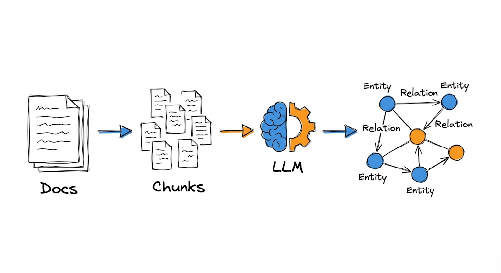
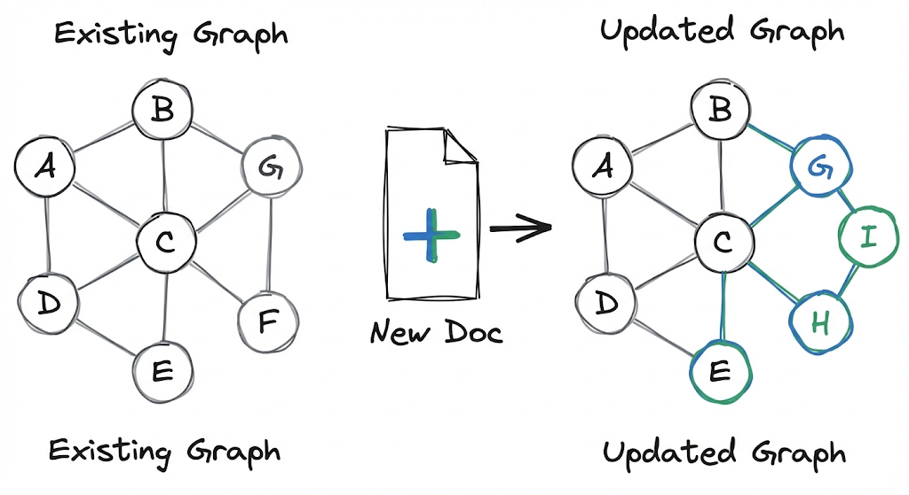
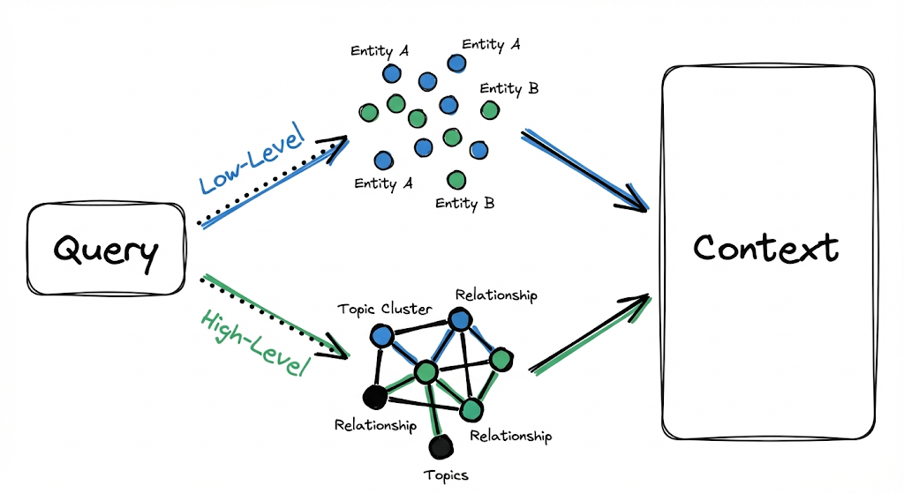

A few weeks ago I wrote about [GraphRAG](/en/posts/graph-rag/) and how it changed the way we think about information retrieval using knowledge graphs. It was a huge advancement because it stopped relying exclusively on finding similar text and started understanding implicit relationships between entities.

But after implementing it and using it in projects, I encountered some friction points. The most obvious one is having to choose between "Local" mode and "Global" mode before making a query. That works well in theory, but in practice it forces you to think: "Does this question need specific detail or broad synthesis?" And the answer is often "both," which leaves you with a design problem.

The other friction point has to do with scalability. When the database grows or changes frequently, rebuilding indices and maintaining graph coherence becomes costly and slow. It's not a minor issue if you're working with data that updates frequently.

That's when I started researching **LightRAG** more deeply. What caught my attention wasn't a single revolutionary feature, but how it reorganizes what we already knew how to do to make it more fluid, faster, and less rigid. This post is a detailed analysis of how LightRAG works internally, explaining each component and why it represents a step forward in the evolution of RAG systems.

---

## The Problem with Traditional RAG

Before diving into LightRAG, it's worth understanding the limitations of conventional RAG well. It's not that I want to tear it down, because it worked and continues to work for many use cases, but rather to understand why we need something more.

The classic RAG architecture works like this: you take your documents, split them into chunks, generate embeddings for each chunk, and store them in a vector database. When a query arrives, you convert it to an embedding, search for the most similar chunks, and pass them to the model as context to generate a response.

There's not much science to it, really. It's quite simple. But it has a structural problem: **each chunk lives in isolation**.

*Chunks in traditional RAG have no connection to each other, making it difficult to synthesize distributed information.*

If your corpus (structured collection of texts) talks about electric cars in one document, air quality in another, and public transportation planning in a third, the system can retrieve pieces from each when you ask how they relate. But those pieces don't know anything about each other. They're chunks that match by vector similarity, but they have no structure connecting them semantically.

Suppose you ask your system a complex question (which I think it couldn't answer): "How does the increase in electric cars influence urban air quality and public transportation infrastructure?"

A conventional RAG might return the following chunks:
- One about electric car adoption and their benefits
- Another about pollution levels in cities
- Another about investment in public transportation

Three pieces of individually correct information, but without any synthesis of how electric car adoption can reduce emissions, and how that air quality improvement can influence urban planning decisions that affect public transportation. This doesn't work—you're retrieving loose information that the model has to piece together on its own, and it might even make things up (because it doesn't have what it needs to answer, the model has to fill in those "blanks" that the system never explicitly connected).

This problem becomes more severe when the question requires integrating information from many different sources. I don't want to sound too negative—it's not that RAG as such doesn't work, but rather that its architecture isn't designed for this type of complex query.

### The Two Fundamental Limitations

From all this, we can summarize the problem into two structural limitations:

**1. Flat knowledge representation:** Chunks are isolated units. There's no way to know if "Company X" mentioned in document 3 is the same as "the company" referenced in document 7. There's also no way to follow chains of relationships, like "John works at X, X produces Y, Y competes with Z."

**2. Lack of contextual awareness:** By retrieving chunks through vector similarity, the system prioritizes superficial lexical or semantic matches. It can bring text that uses similar words without being relevant to the specific question, and it can ignore text with different formulations that actually contains the answer.

GraphRAG attacked these limitations using knowledge graphs. LightRAG goes further by proposing a more integrated and efficient architecture. But before seeing how, we need a clear way to describe what a RAG system does.

---

## Formalizing a RAG System (Skip This If You Don't Like Math)

To properly understand what makes LightRAG different, we first need a clear way to describe any RAG system. The paper proposes a mathematical formalization that proves useful for comparing approaches.

A RAG system can be represented as:

$$
\mathcal{M} = (\mathcal{G}, \mathcal{R})
$$

Where:
- $\mathcal{M}$ is the complete system
- $\mathcal{G}$ is the **generator** (typically an LLM that writes the response)
- $\mathcal{R}$ is the **retriever** (the component that searches for relevant information)

The retriever $\mathcal{R}$ decomposes into two functions:
- $\varphi$: Transforms the raw document base $D$ into a search-ready representation $\hat{D}$
- $\psi$: Executes retrieval given a query $q$

The complete response operation is expressed as:

$$
\mathcal{M}(q; D) = \mathcal{G}(q, \psi(q; \hat{D}))
$$

Where $\hat{D} = \varphi(D)$ is the processed base (the index).

This formalization lets us clearly see where each component acts. In traditional RAG, $\varphi$ consists of chunking + embeddings + vector indexing. In LightRAG, $\varphi$ is much more sophisticated: it builds a knowledge graph with profiled entities.

Now that we have the theoretical framework, let's see how LightRAG implements this in practice.

---

## LightRAG Architecture: The Indexing Pipeline

This is where the important differences begin. LightRAG replaces flat indexing (used in traditional RAGs) with a graph-based paradigm that seeks to capture interdependencies between concepts from the moment of indexing, before any query arrives.

*The indexing pipeline transforms documents into a structured knowledge graph.*

The process has four main stages: segmentation, entity and relationship extraction, indexing, and retrieval.

### 1. Document Segmentation

The first step is to divide documents into chunks $D_i$. This is similar to traditional RAG: you need processable units so the LLM can analyze them. The chunk size affects both cost (more chunks = more LLM calls) and quality (chunks that are too small lose context, too large makes precise extraction difficult).

Up to here, nothing new. The difference comes in what we do with those chunks.

### 2. Entity and Relationship Extraction

For each chunk $D_i$, an LLM identifies:
- **Entities**: names, places, dates, concepts, events—anything that can function as a node in a graph
- **Relationships**: explicit links between entities ("John works at X," "X produces Y," "A is a type of B")

The paper formalizes this as:

$$
V, E = \bigcup_{D_i \in D} \text{Recog}(D_i)
$$

Where $\text{Recog}(D_i)$ is the recognition function that extracts the set of vertices (entities) and edges (relationships) from each chunk, and the union $\cup$ combines the results from all chunks.

For example, if the chunk says:

> "Cardiologists evaluate symptoms to identify possible heart problems. If chest pain and difficulty breathing persist, they recommend an ECG and blood tests."

The extraction would produce:

**Entities:**
- Cardiologists (type: medical professional)
- Symptoms (type: medical concept)
- Heart problems (type: medical condition)
- Chest pain (type: symptom)
- Difficulty breathing (type: symptom)
- ECG (type: medical procedure)
- Blood tests (type: medical procedure)

**Relationships:**
- Cardiologists EVALUATE Symptoms
- Symptoms INDICATE Heart problems
- Chest pain IS_TYPE_OF Symptoms
- Difficulty breathing IS_TYPE_OF Symptoms
- Cardiologists RECOMMEND ECG
- Cardiologists RECOMMEND Blood tests

This process repeats for each chunk in the entire corpus.

### 3. Profiling with Key-Value Pairs

Here comes one of LightRAG's most interesting ideas. Once you have the extracted entities and relationships, the system generates a **profile** for each one, expressed as a key-value pair.

*Each entity and relationship is transformed into a key-value pair optimized for retrieval.*

For each entity and each relationship, the system builds:
- **Key**: A word or short phrase designed for efficient retrieval (basically, optimized search terms)
- **Value**: A textual paragraph summarizing the relevant evidence about that entity or relationship, including snippets from the original source

For example, for the "Cardiologists" node, the profile might be:

**Key:** `"Cardiologists"`

**Value:** `"Cardiologists are medical professionals specialized in evaluating cardiovascular symptoms. When persistent symptoms such as chest pain and difficulty breathing occur, they recommend diagnostic studies like ECG and blood tests. [Source: document X, paragraph Y]"`

For the relationship "Cardiologists RECOMMEND ECG," multiple keys can be generated:

**Keys:** `["Cardiologists ECG", "ECG recommendation", "cardiac diagnosis"]`

**Value:** `"Cardiologists recommend electrocardiograms (ECG) as a diagnostic tool when patients present persistent symptoms of heart problems, particularly chest pain and respiratory difficulty. [Source: document X]"`

This transformation is very important. By having keys optimized for search and values with rich context, the system can retrieve precise information while delivering sufficient context to generate relatively coherent responses.

The paper's formalization expresses this as:

$$
\hat{D} = (\hat{V}, \hat{E}) = \text{Dedupe} \circ \text{Prof}(V, E)
$$

Where $\text{Prof}$ is the profiling and $\text{Dedupe}$ is the deduplication.

### 4. Deduplication

The last step in the indexing pipeline is identifying and merging duplicate entities and relationships. This is crucial because the same entity can appear with different names in different parts of the corpus:

- "Heart problems" and "Cardiac conditions" probably refer to the same concept
- "John Smith" and "J. Smith" are probably the same person
- "AI" and "Artificial Intelligence" clearly refer to the same thing

Deduplication consolidates these variants into a single canonical node, preserving aliases and merging descriptions. This reduces graph size and improves efficiency in both indexing and subsequent retrieval.

With the indexing pipeline complete, we now have our graph built. Now comes the obvious question: was all this extra work worth it?

---

## The Advantages of Graph Indexing

Before moving on to text retrieval, let's take a 30-second break. Let's think about why all this complexity (which so far seems a bit excessive) is worth it...

If you didn't think of it, I'll spoil it for you.
> We have 2 main advantages: information comprehension and retrieval.

### Distributed Information Comprehension

By having graph structures, the system can extract information that spans multiple chunks by following paths of relationships between entities.

Returning to the electric cars example, if the graph has:
> - "Electric cars" node connected to "Emission reduction"
> - "Emission reduction" connected to "Urban air quality"
> - "Urban air quality" connected to "Urban planning"
> - "Urban planning" connected to "Public transportation"

Now the system can answer the original question by following the graph path, integrating information from sources that individually never mentioned all these concepts together.

### Fast and Precise Retrieval

The key-value pairs derived from the graph are optimized for vector search. Instead of searching over generic text chunks (which can bring false positives due to superficial lexical matches), you search over keys specifically designed to match with specific types of queries.

Additionally, matching is over conceptual entities and relationships, not raw text. This significantly reduces **noise** in retrieval.

The technical reason for this is that chunk embeddings function as an average of all the content in that chunk.

> For example, if a chunk has 300 words where 250 talk about a hospital's history and 50 words mention that a specific treatment is performed there, in Traditional RAG the vector for that chunk will be "diluted" or dominated by the hospital history topic. If you search for the treatment, the signal is weak and brings a lot of "noise" (the rest of the irrelevant text).

In LightRAG, instead, the specific relationship Hospital X PERFORMS Treatment Y is extracted. An exclusive vector is generated for that relationship.
By matching the question against a distilled and pure concept, rather than a bag of mixed words where the main topic overshadows important details, you reduce noise.

But there's another problem we haven't mentioned yet: what happens when your corpus changes?

---

## Incremental Graph Updates

A huge problem with GraphRAG (and with any heavy indexing system) is what to do when new documents arrive. If you have to rebuild the entire index every time you add a document, the system becomes impractical for scenarios where data changes frequently.

*LightRAG allows adding new documents without rebuilding the complete graph.*

LightRAG solves this with an **incremental update** strategy. When a new document $D'$ arrives, the system:

> 1. Applies the same indexing pipeline to produce $\hat{D}' = (\hat{V}', \hat{E}')$
> 2. Integrates the new graph with the existing one: $\hat{V} \cup \hat{V}'$ and $\hat{E} \cup \hat{E}'$
> 3. Executes deduplication to merge entities that already existed

The interesting part here is that you don't need to rebuild the complete graph. New entities and relationships are added to the existing structure, and deduplication takes care of maintaining coherence if there's overlap with prior knowledge.

This has two concrete benefits:
- **Reduced computational cost**: You only process what's new, not everything
- **Integration without disruption**: Historical knowledge is preserved and remains accessible while new information is incorporated

We've seen how the graph is built and how it's updated. Now comes the most interesting part: how LightRAG uses all this to answer questions.

---

## Dual-Level Retrieval Paradigm

Now we arrive at LightRAG's other fundamental innovation: how it retrieves information when a query arrives.

GraphRAG forces you to choose between "Local" search (oriented toward specific entities) and "Global" search (oriented toward high-level synthesis). LightRAG proposes that both strategies coexist within the same execution, without needing to choose an explicit route.

*LightRAG executes low and high-level retrieval in parallel, without forcing a choice.*

### Low Level: Specific Queries

Some queries are fairly straightforward. "Who wrote The Eternaut?" needs a specific piece of data: the name of a person associated with a specific entity (the book).

Low-level retrieval focuses precisely on this:
- Finding specific entities mentioned or implied in the query
- Retrieving their direct attributes
- Retrieving the immediate relationships they participate in

### High Level: Abstract Queries

Other queries are broader. "How does artificial intelligence influence modern education?" doesn't aim at a specific piece of data, but at a pattern, a synthesis, a theme that spans multiple entities and contexts.

High-level retrieval addresses this by aggregating information across multiple entities and relationships, providing insights about higher-order concepts rather than specific data.

### How They Work Together

For each query $q$, the algorithm:

> 1. **Extracts two types of keywords:**
>    - Local keywords $k^{(l)}$: specific terms, entity names, specific data points
>    - Global keywords $k^{(g)}$: thematic signals, relational patterns, abstract concepts
>
> 2. **Executes vector search:**
>    - Local keywords are matched against candidate **entities** in the vector database
>    - Global keywords are matched against **relationships** associated with global keys
>
> 3. **Expands structural context:**
>    - For each retrieved element (whether entity or relationship), the system incorporates its **one-hop neighbors** in the graph
>    - This introduces immediate context without exponentially exploding the amount of information

Formally, the expansion collects the set:

$$
\{v_i \mid v_i \in V \land (v_i \in N_v \lor v_i \in N_e)\}
$$

Where $N_v$ and $N_e$ represent the one-hop neighbors of the recovered nodes and edges respectively.

This prevents retrieval from being limited to isolated elements. If you retrieve the entity "ECG" because it matched a keyword, you also bring the relationships it participates in (who recommends it, what it's used for, what it indicates) and the connected entities. Context is enriched automatically.

With the context assembled, only one step remains: generating the response.

---

## Response Generation

With the retrieved context, it's time to generate the response. But here too there's an important difference compared to traditional RAG.

In conventional RAG, the context you pass to the LLM consists of raw text chunks, directly as they appear in the original documents. The model has to make sense of that text, extract what's relevant, and formulate a coherent response.

In LightRAG, the context consists of the **values** from the retrieved entities and relationships. These values were already processed and optimized during indexing, and contain clear entity names and descriptions, relationship descriptions with context, excerpts from the original text that function as evidence, and references to sources.

The LLM receives information already structured around entities and links. It doesn't have to parse raw text and extract what's important because that's already done. Its job simplifies to taking that pre-digested information and formulating it as a coherent response to the query.

This significantly reduces the risk that the model "hallucinates" or invents information. The context it receives is well-defined, has references, and is semantically organized.

Having seen the entire LightRAG pipeline, it's natural to ask: how exactly does it differ from GraphRAG?

---

## LightRAG vs GraphRAG

After understanding how LightRAG works, the natural thing is to compare it with GraphRAG, because at first glance they both use graphs. The difference lies in how they get you to the evidence when the question is tricky and needs both detail and overview.

### Separation vs Unification of Modes

In GraphRAG, there are two paths:

> The **local** mode, where if you ask about something specific, it stands at that node, looks at nearby neighbors and brings related chunks, and the **global** mode, where it first builds communities in the graph, then generates summaries per community, and only then uses a map-reduce scheme to synthesize a broad answer.

The thing is, in practice many questions don't come clean. Sometimes you want a fact and also the explanation around it. And there GraphRAG forces you to decide between local or global. If you choose wrong, you end up running the other mode too, costing you double in latency and complexity.

LightRAG specifically aims to avoid that decision. For each query it generates two groups of keywords, some more local and others more global, and retrieves both in parallel. It brings relevant entities and relationships at the same time, and then adds context with one-hop neighbor expansion. You don't have to choose the mode—the system mixes specific evidence and contextual evidence when needed.

This makes LightRAG more direct when the question mixes detail with explanation, because it doesn't send you to a separate pipeline to enter "global" mode.

---

## Conclusion

LightRAG represents a significant evolution in how to design RAG systems with knowledge graphs. It takes the fundamental ideas that GraphRAG introduced and reorganizes them into a more fluid and practical architecture.

Like any system, it's not perfect or universal. It has a higher indexing cost than traditional RAG (you have to extract entities, generate profiles, build the graph). But that upfront cost is paid once and then amortized in each query with better precision and coherence.

If you're working with complex, interconnected, or dynamic corpora, LightRAG offers a solid framework to explore.

But there's something LightRAG still doesn't solve: **multimodal content**. Real documents aren't just text. They have images, tables, charts, diagrams, PDFs with complex layouts. LightRAG, like GraphRAG, assumes your input is plain text. If you have a paper with a key figure explaining the architecture, or a table with comparative data, that information gets lost in the indexing pipeline.

This isn't a minor defect. In many domains (medicine, engineering, scientific research), visual information is as important as text. A RAG system that ignores that is leaving valuable knowledge out.

**And this is where RAG Anything comes in.** It's an approach that extends LightRAG's ideas to handle multimodal documents natively. In the next post we'll analyze how it works, what architecture it proposes, and why it represents the next logical step in the evolution of RAG systems.

---

**Reference:**
Guo, Z., et al. (2024). *LightRAG: Simple and Fast Retrieval-Augmented Generation*. arXiv preprint arXiv:2410.05779. Available at: [https://arxiv.org/abs/2410.05779](https://arxiv.org/abs/2410.05779)
