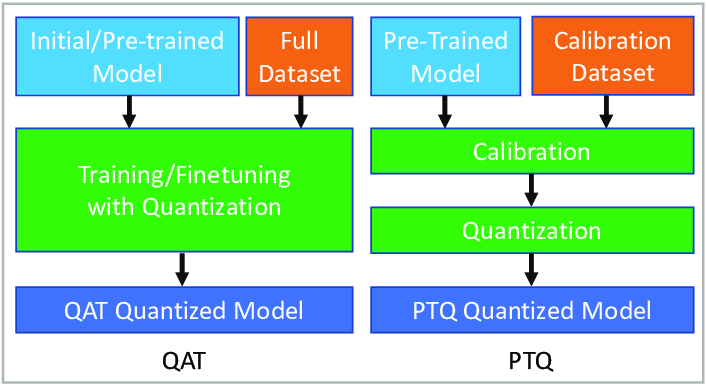
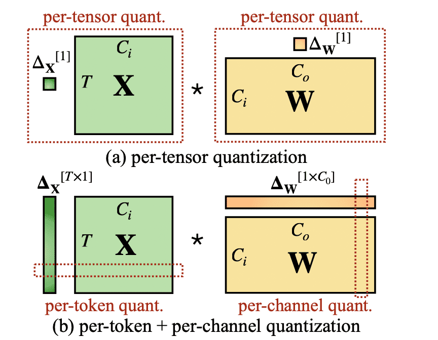

To train models at scale you need a solid grip on a handful of ideas that decide both speed and stability. This walkthrough focuses on numeric precision, data parallelism, quantization, LoRA, and a few other pieces you actually use in practice.

## Numeric Precision

The numeric format you choose (FP32, FP16, BF16, FP8, INT8, and so on) drives throughput, memory footprint, and training stability. You cannot ignore it if you care about scaling. This section explains how precision works and how it shows up in real training runs.

### Why precision matters

A computer is finite. Real numbers are not. If you try to represent something like $\pi$, which has infinitely many decimals, you need an approximation scheme. Floating point is that scheme.

Floating point approximates a real value using three parts: a sign, a mantissa that controls fine resolution within a fixed interval, and an exponent that sets the dynamic range so you can represent very large and very small magnitudes. In IEEE 754 the base is 2, so the usual model is

$$
\text{value} \approx \text{sign}\times \text{mantissa}\times \text{base}^{\text{exponent}}.
$$

More bits in the mantissa buy you finer resolution. More bits in the exponent buy you wider range.

<figure>
 
 <figcaption style="text-align: center; font-size: 0.95em; color: #666;">
   Figure 1. FP32 layout under IEEE 754.
 </figcaption>
</figure>

This matters for three simple reasons. Low-bit formats run faster on modern accelerators and use less memory. If the range or resolution is too small, you get overflows, underflows, or loss of significance that can wreck training. And if you want to train big LLMs without burning money, you lean on mixed precision to keep compute and memory in check.

<figure>
 
 <figcaption style="text-align: center; font-size: 0.95em; color: #666;">
   Figure 2. The formats you actually see in deep learning: <b>BF16</b>, <b>FP32</b>, <b>FP16</b>.
 </figcaption>
</figure>

### FP32 (single precision)

Think of this as the baseline. It uses 1 bit for sign, 8 for exponent, and 23 for mantissa. The range spans roughly $1.18\times10^{-38}$ to $3.4\times10^{38}$ and machine epsilon is about $1.19\times10^{-7}$. Even if you store tensors in lower precision to save memory, critical accumulations are often kept in FP32 to keep training steady.

### FP16 (half)

FP16 cuts memory and usually speeds things up on the right hardware. The tradeoff is less detail and smaller range. Tiny numbers can vanish and large ones can saturate. That is why people apply loss scaling: you temporarily scale up losses and gradients so they sit in a safe numerical range, then scale updates back down.

### BF16 (brain floating point)

BF16 is the current workhorse on TPUs and recent GPUs like H100. It keeps the FP32-sized exponent so the dynamic range matches FP32, but trims mantissa bits. In practice this avoids most overflow and underflow issues without resorting to tricks like loss scaling. You give up some decimal detail, which is usually fine for large-scale training.

## Comparing precisions

I will use JAX for quick experiments. It makes it easy to run on GPUs and TPUs and later helps show parallelism and memory behavior more transparently than other stacks.

First, query versions, backend, and devices:

```python
import jax
# JAX setup
print(f"JAX version: {jax.__version__}")
print(f"JAX backend: {jax.default_backend()}")
print(f"Available devices: {jax.devices()}")
```

I will time code and inspect memory with `psutil`, `tracemalloc`, and `time`.

```python
import jax.numpy as jnp
import psutil
import tracemalloc
import time

def get_memory_usage():
   """Return current process RSS in MB."""
   process = psutil.Process()
   return process.memory_info().rss / 1024 / 1024

def measure_memory_and_time(func):
   def wrapper(*args, **kwargs):
       tracemalloc.start()
       start_memory = get_memory_usage()
       start_time = time.time()
       result = func(*args, **kwargs)
       jax.block_until_ready(result)
       end_time = time.time()
       end_memory = get_memory_usage()
       current, peak = tracemalloc.get_traced_memory()
       tracemalloc.stop()
       return {
           'result': result,
           'execution_time': end_time - start_time,
           'memory_delta': end_memory - start_memory,
           'peak_memory': peak / 1024 / 1024,
           'current_memory': current / 1024 / 1024
       }
   return wrapper
```

Now a matrix multiply micro-bench and a tiny feedforward pass, both wrapped with the helper above.

```python
@measure_memory_and_time
def matrix_multiplication_test(dtype, shape):
   """Matrix multiply at a given dtype."""
   key = jax.random.PRNGKey(42)
   key1, key2 = jax.random.split(key)
   def matmul_operation():
       a = jax.random.normal(key1, shape, dtype=dtype)
       b = jax.random.normal(key2, shape, dtype=dtype)
       return jnp.dot(a, b)
   return matmul_operation()

@measure_memory_and_time
def neural_network_forward_pass_test(dtype, input_size, hidden_size, output_size):
   """One forward pass of a tiny MLP."""
   key = jax.random.PRNGKey(123)
   keys = jax.random.split(key, 3)
   def nn_forward():
       # Weight init
       W1 = jax.random.normal(keys[0], (input_size, hidden_size), dtype=dtype)
       b1 = jax.random.normal(keys[1], (hidden_size,), dtype=dtype)
       W2 = jax.random.normal(keys[2], (hidden_size, output_size), dtype=dtype)
       b2 = jax.random.normal(keys[2], (output_size,), dtype=dtype)
       # Input
       x = jax.random.normal(keys[0], (input_size,), dtype=dtype)
       # Forward
       h = jnp.tanh(jnp.dot(x, W1) + b1)
       y = jnp.dot(h, W2) + b2
       return y
   return nn_forward()
```

Run like this:

```python
matrix_multiplication_test(jnp.float16, (5000, 5000))
neural_network_forward_pass_test(jnp.float16, 784, 256, 10)
```

I will also include FP64 to show a result that looks counterintuitive at first glance. Results depend on hardware. On an M1 the numbers looked like this, time in seconds and memory in MB.

<div style="display: flex; gap: 2px; flex-wrap: wrap;">

<div style="flex: 1; min-width: 300px;">

**Matrix multiplication**

| Precision | Time      | Peak Memory |
| --------- | --------- | ----------- |
| FP16      | 1.024     | 0.013       |
| BF16      | 0.978     | 0.008       |
| FP32      | 0.943     | 0.008       |
| FP64      | **0.928** | 0.009       |

</div>

<div style="flex: 1; min-width: 300px;">

**Neural network**

| Precision | Time      | Peak Memory |
| --------- | --------- | ----------- |
| FP16      | 0.007     | 0.020       |
| BF16      | 0.004     | 0.015       |
| FP32      | 0.003     | 0.015       |
| FP64      | **0.002** | 0.016       |

</div>

</div>

If you stop here you might think the whole discussion is useless because FP64 came out faster. That reading is wrong. CPUs like the M1 are tuned for FP32 and FP64 through vendor libraries such as Accelerate. FP16 and BF16 often get converted behind the scenes when you run on CPU, which adds overhead that dominates at this tiny scale. These are small problems, so a lot of the runtime is setup and conversion, not the math. And on GPUs the story flips because Tensor Cores are built to chew through FP16 and BF16 while moving less data.

If you repeat these tests on a GPU with much larger matrices, you will see the expected speedups. A simple TFLOP comparison from vendor docs makes the point.

<div style="display: flex; justify-content: center;">
  <figure>
    
    <figcaption style="text-align: center; font-size: 0.95em; color: #666;">
      Figure 3. Throughput grows as precision drops on matrix ops.
    </figcaption>
  </figure>
</div>

To wrap this section, here is a minimal mixed-precision example. Do the numerically sensitive work in FP32, then cast results to a cheaper format for storage.

```python
def mixed_precision_forward_pass(x, W, b):
   # Promote to FP32 for compute
   x_fp32 = x.astype(jnp.float32)
   W_fp32 = W.astype(jnp.float32)
   b_fp32 = b.astype(jnp.float32)
   # Forward
   y = jnp.dot(x_fp32, W_fp32) + b_fp32
   # Store in FP16 to save memory
   return y.astype(jnp.float16)
```

## Quantization

Training often keeps critical math in FP32 and uses FP16 for the rest. Deployment is a different game. You want lower latency and smaller memory footprints without trashing quality. Quantization does exactly that by representing weights and activations with fewer bits and accepting a controlled numeric error. You usually try Post-Training Quantization first. If that is not enough, you switch to Quantization-Aware Training.

<div style="display: flex; flex-direction: column; align-items: center; margin: 2em 0;">
  
  <p style="text-align: center; margin-top: 0.5em; color: #555;">
    Figure 4. QAT on the left, PTQ on the right.
  </p>
</div>

### Post-Training Quantization (PTQ)

PTQ takes a trained model and converts weights and activations to a low-bit format without retraining. Most of the time this is enough.

Starting from a real value $x\in\mathbb{R}$, the standard affine uniform quantizer maps $x$ to an integer $q$ with $b$ bits using a scale $s$ and a zero point $z$:

$$
q = \operatorname{clip}\Big(\operatorname{round}\big(\tfrac{x}{s}\big) + z,\ q_{\min}, q_{\max}\Big),
\qquad
\hat{x} = s\,(q - z).
$$

For signed $b$-bit integers, $q_{\min}=-2^{b-1}$ and $q_{\max}=2^{b-1}-1$. Given a target real interval $[\alpha,\beta]$ you get a practical choice

$$
s=\frac{\beta-\alpha}{q_{\max}-q_{\min}},
\qquad
z=\operatorname{round}\Big(\frac{-\alpha}{s}\Big)+q_{\min}.
$$

If $z=0$ you have symmetric quantization, which centers the integer range around zero. If your distribution is skewed, an asymmetric choice with $z\neq 0$ shifts the range and uses the available levels better.

Here is a simple reference in Python:

```python
import jax.numpy as jnp

def quantize_tensor(x, num_bits=8, signed=True, eps=1e-8):
    if signed:
        qmin = - (2 ** (num_bits - 1))
        qmax = 2 ** (num_bits - 1) - 1
    else:
        qmin = 0
        qmax = 2 ** num_bits - 1

    x_min = jnp.min(x)
    x_max = jnp.max(x)

    scale = (x_max - x_min) / (qmax - qmin + eps)
    scale = jnp.where(scale == 0, 1.0, scale)

    zero_point = jnp.round(qmin - x_min / (scale + eps))
    zero_point = jnp.clip(zero_point, qmin, qmax)

    q = jnp.clip(jnp.round(x / (scale + eps) + zero_point), qmin, qmax).astype(jnp.int32)
    x_hat = scale * (q.astype(jnp.float32) - zero_point)

    return q, x_hat, float(scale), int(zero_point)
```

Weights are often fine with per-tensor or per-channel min-max because their distributions are roughly centered. Activations are different. ReLU produces only nonnegative values, so a symmetric scheme wastes half the codes on unused negatives. You solve that with asymmetric or unsigned quantization and by calibrating with a representative dataset so you do not pick ranges that get dominated by outliers. Percentile-based clipping is common because it trades a tiny bias for fewer saturation errors.

<div style="display: flex; flex-direction: column; align-items: center; margin: 2em 0;">
  
  <p style="text-align: center; margin-top: 0.5em; color: #555;">
    Figure 5. Symmetric compared to asymmetric quantization.
  </p>
</div>

If accuracy drops too much with PTQ, move to QAT.

### Quantization-Aware Training (QAT)

QAT trains a model while simulating the quantizer that will be used at inference time. You optimize

<div class="math">$$
\min_{w}\ \mathbb{E}_{(x,y)\sim\mathcal{D}}\Big[L\big(f_{q(w)}(x),\,y\big)\Big].
$$</div>

Here $w$ are the real-valued parameters before quantization. $f_{q(w)}$ is the same network but with weights passed through a quantizer $q(\cdot)$. $L$ is your loss. If you define $q$ with literal rounding and clipping you break differentiability. The usual uniform affine quantizer is

<div class="math">$$
q=\operatorname{clip}\!\big(\operatorname{round}(u),\,q_{\min},\,q_{\max}\big),\quad
u=\frac{w}{s}+z,\quad
\tilde w=s\,(q-z),
$$</div>

and you compute the forward with $\tilde w$, not $w$. To backpropagate you use the straight-through estimator. Treat rounding as the identity in the backward pass and give clipping a derivative of one inside the valid range and zero outside:

<div class="math">$$
\frac{\partial \tilde w}{\partial w}\ \approx\
\begin{cases}
1 & \text{if } q_{\min} < u < q_{\max} \\
0 & \text{otherwise}
\end{cases}
$$</div>

That way gradients flow as long as values stay within range. If you also learn the scale $s$, you keep using STE and get

<div class="math">$$
\frac{\partial \tilde w}{\partial s}\ \approx\
\begin{cases}
-\,z\;-\;\frac{w}{s} & \text{if } q_{\min} < u < q_{\max} \\
\operatorname{clip}(u,\,q_{\min},\,q_{\max})\;-\;z\;-\;\frac{w}{s} & \text{otherwise}
\end{cases}
$$</div>

In practice you normalize this gradient by the number of elements that share the same scale. That is where per-tensor and per-channel schemes show up.

Consider a linear layer with weights $W\in\mathbb{R}^{C_o\times C_i}$ and activations $X\in\mathbb{R}^{T\times C_i}$. Per-tensor uses a single scale for the whole $W$ and another for the whole $X$. It is simple and cheap but wastes resolution if ranges differ a lot internally. Per-channel assigns a different scale to each output channel of $W$, which you can think of as a vector $\Delta_W\in\mathbb{R}^{1\times C_o}$. If you also apply per-token on activations you get $\Delta_X\in\mathbb{R}^{T\times 1}$ so each row of $X$ has its own scale. This aligns with the real heterogeneity of values and reduces error at 8 bits and especially at 4 bits, at the cost of extra scale storage.

<p align="center">
  
</p>

<p align="center" style="color:#555; margin-top:0.5em;">
  \(X\in\mathbb{R}^{T\times C_i}\) are activations and \(W\in\mathbb{R}^{C_o\times C_i}\) are weights. The top diagram shows per-tensor with single scales \(\Delta X[1]\) and \(\Delta W[1]\). The bottom shows per-token plus per-channel with \(\Delta X[T\times 1]\) and \(\Delta W[1\times C_o]\). Dashed boxes indicate the region each scale covers.
</p>

Training reduces to standard empirical risk with mini-batches while applying the same quantization scheme in the forward. For each step you compute outputs with $\tilde w=s\,(q-z)$ using the chosen granularity for weights and, if applicable, activations. You evaluate the loss, backpropagate with STE, normalize scale gradients by the number of elements they cover, and update $w$ plus scales if they are learnable:

<div class="math">$$
\min_{w}\ \frac{1}{B}\sum_{i=1}^{B} L\big(f_{\tilde w}(x_i),\,y_i\big).
$$</div>
