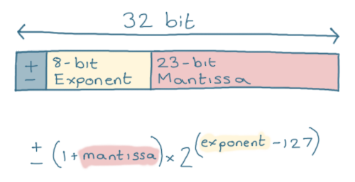

To train models at large scale, we need to understand various concepts that will help us optimize performance and training stability. That's why in this guide, we'll look at concepts like numerical precision, data parallelism, quantization, LoRA, and more.


## Numerical Precision


The choice of numerical format (FP32, FP16, BF16, FP8, INT8, etc.) constitutes one of the most determining factors for performance, memory usage, and stability of large-scale model training. That's why it's important to understand how numerical precision works and how it affects model performance, which will be explained in this section.


### ¿Por qué Importa la Precisión?


Primero, necesitamos entender que intentan hacer los formatos de punto flotante. Principalmente, intentan representar un valor real de manera aproximada, y lo hacen con dos componentes clave: la _mantisa_ y el _exponente_.


Un número en punto flotante representa aproximadamente un valor real mediante la fórmula:


$$\text{valor} \approx \text{signo} \times \text{mantisa} \times \text{base}^{\text{exponente}}$$


donde:
- **Mantisa**: Controla la resolución fina (cuántos pasos discretos entra en el intervalo 1.0 - 2.0)
- **Exponente**: Determina el rango dinámico (qué tan grandes o pequeños pueden ser los números representables)
- **Base**: En IEEE 754 es 2.


Más bits para la mantisa $\rightarrow$ mayor precisión; más bits para el exponente $\rightarrow$ mayor rango


<figure>
 
 <figcaption style="text-align: center; font-size: 0.95em; color: #666;">
   Esquema de la representación de un número en punto flotante de 32 bits (FP32) según el estándar IEEE 754. <br>
  
 </figcaption>
</figure>


Pero, ¿por qué es importante?


Bueno, hay tres razones principales por las que la precisión numérica es crucial en el entrenamiento de modelos de gran escala.


- **Eficiencia computacional**: Los formatos de menor ancho de bits aceleran el cómputo en Tensor Cores/TPUs y reducen significativamente el uso de memoria.


- **Estabilidad numérica**: El rango dinámico y la granularidad de representación afectan directamente el underflow/overflow y el ruido numérico durante el entrenamiento.


- **Escabilidad**: Entrenar LLMs a gran escala requiere aprovechar la precisión mixta para que el costo computacional sea viable económicamente.


## Formatos de precisión numérica
Los formatos de punto flotante son muy variados, pero los más comunes son:


<figure>
 
 <figcaption style="text-align: center; font-size: 0.95em; color: #666;">
   Comparación visual de los formatos de punto flotante más utilizados en deep learning: <b>BF16</b>, <b>FP32</b> y <b>FP16</b>. <br>
  
 </figcaption>
</figure>


### FP32 (IEEE 754, precisión simple)


Este es el punto de referencia para casi todo. Usa 1 bit de signo, 8 de exponente y 23 de mantisa. Su épsilon es $\varepsilon \approx 2^{-23} \approx 1.19\times10^{-7}$ y cubre un rango amplio, desde $1.18\times10^{-38}$ hasta $3.4\times10^{38}$.


En práctica de ML lo tomamos como “precisión plena”. Incluso cuando trabajamos con precisión mixta, los acumuladores de gradientes se mantienen en FP32 para que el entrenamiento no se desestabilice.


### FP16 (IEEE 754, half)


Acá buscamos velocidad y ahorro de memoria. FP16 tiene 1 bit de signo, 5 de exponente y 10 de mantisa, con $\varepsilon \approx 2^{-10} \approx 9.77\times10^{-4}$ y rango aproximado de $6.1\times10^{-5}$ a $6.55\times10^{4}$. Suele acelerar tanto el entrenamiento como la inferencia, aunque conviene usar <a href="https://picdictionary.com/ml-dictionary/loss-scaling-in-ai-and-deep-learning" target="_blank" rel="noopener">loss scaling</a> para que los gradientes chicos no desaparezcan.


Además, ofrece mejor resolución fraccional que BF16, pero el rango dinámico es más corto, así que se puede llegar a saturar con activaciones o gradientes grandes y “apagar” señales muy chiquititas.


### BF16 (Brain Floating Point)


El favorito actual para entrenar modelos grandes en TPUs y GPUs, como una H100. Tiene 1 bit de signo, 8 de exponente y 7 de mantisa, con $\varepsilon \approx 2^{-7} \approx 7.81\times10^{-3}$. Lo clave es que comparte el mismo rango que FP32, de $1.18\times10^{-38}$ a $3.4\times10^{38}$. En la práctica suele funcionar sin _loss scaling_. Mantiene el rango amplio que evita overflows y underflows molestos, y aunque la resolución fraccional sea menor que en FP16, para LLMs entrenando en serio suele alcanzar sin dramas.


## Comparación de precisiones


Para comparar las precisiones, voy a usar JAX, que es un framework de ML hecho por Google, que permite realizar operaciones de manera eficiente en GPUs y TPUs. La razón de utilizar JAX y no PyTorch, por ejemplo, es que JAX nos permitirá más adelante ver en "crudo" la paralelización de las operaciones y la optimización de la memoria.


Primero, importamos JAX y vemos la versión y el backend, así como los dispositivos disponibles:


```python
import jax


# Configuración de JAX
print(f"JAX version: {jax.__version__}")
print(f"JAX backend: {jax.default_backend()}")
print(f"Available devices: {jax.devices()}")
```


Para medir el rendimiento y la memoria, necesitamos funciones para obtener el uso de memoria y medir el tiempo de ejecución. Para esto, vamos a usar `psutil`, `tracemalloc` y `time`.


```python
import jax.numpy as jnp
import psutil
import tracemalloc
import time


def get_memory_usage():
   """Obtiene el uso actual de memoria en MB"""
   process = psutil.Process()
   return process.memory_info().rss / 1024 / 1024


def measure_memory_and_time(func):
   def wrapper(*args, **kwargs):
       tracemalloc.start()
       start_memory = get_memory_usage()
      
       start_time = time.time()
       result = func(*args, **kwargs)
       jax.block_until_ready(result)
       end_time = time.time()
      
       end_memory = get_memory_usage()
       current, peak = tracemalloc.get_traced_memory()
       tracemalloc.stop()
      
       return {
           'result': result,
           'execution_time': end_time - start_time,
           'memory_delta': end_memory - start_memory,
           'peak_memory': peak / 1024 / 1024,
           'current_memory': current / 1024 / 1024
       }
   return wrapper
```


Ahora, vamos a medir el rendimiento y la memoria de la multiplicación de matrices y la red neuronal. Para esto, vamos a usar la función `measure_memory_and_time` que definimos anteriormente.


```python
@measure_memory_and_time
def matrix_multiplication_test(dtype, shape):
   """Prueba de multiplicación de matrices con precisión dada"""
   key = jax.random.PRNGKey(42)
   key1, key2 = jax.random.split(key)
  
   def matmul_operation():
       a = jax.random.normal(key1, shape, dtype=dtype)
       b = jax.random.normal(key2, shape, dtype=dtype)
       return jnp.dot(a, b)
  
   return matmul_operation()


@measure_memory_and_time
def neural_network_forward_pass_test(dtype, input_size, hidden_size, output_size):
   """Prueba de pase forward de red neuronal simple"""
   key = jax.random.PRNGKey(123)
   keys = jax.random.split(key, 3)
  
   def nn_forward():
       # Inicialización de pesos
       W1 = jax.random.normal(keys[0], (input_size, hidden_size), dtype=dtype)
       b1 = jax.random.normal(keys[1], (hidden_size,), dtype=dtype)
       W2 = jax.random.normal(keys[2], (hidden_size, output_size), dtype=dtype)
       b2 = jax.random.normal(keys[2], (output_size,), dtype=dtype)
      
       # Datos de entrada
       x = jax.random.normal(keys[0], (input_size,), dtype=dtype)
      
       # Pase forward
       h = jnp.tanh(jnp.dot(x, W1) + b1)
       y = jnp.dot(h, W2) + b2
      
       return y
  
   return nn_forward()
```
Para correr las pruebas, simplemente llamamos a las funciones `matrix_multiplication_test` y `neural_network_forward_pass_test` con los tipos de precisión y las dimensiones de las matrices y la red neuronal, por ejemplo:


```python
matrix_multiplication_test(jnp.float16, (5000, 5000))
neural_network_forward_pass_test(jnp.float16, 784, 256, 10)
```


Corriendo las pruebas en un M1, obtenemos los siguientes resultados para la multiplicación de matrices:


| Precisión | Tiempo (s) | Memoria Delta (MB) | Memoria Pico (MB) |
|-----------|------------|-------------------|-------------------|
| FP16      | 1.024      | 448.61           | 0.013             |
| BF16      | 0.978      | 49.33            | 0.008             |
| FP32      | 0.943      | -49.25           | 0.008             |
| FP64      | 0.928      | 7.84             | 0.009             |


Y para la red neuronal:


| Precisión | Tiempo (s) | Memoria Delta (MB) | Memoria Pico (MB) |
|-----------|------------|-------------------|-------------------|
| FP16      | 0.007      | 11.59            | 0.020             |     
| BF16      | 0.004      | 4.81             | 0.015             |     
| FP32      | 0.003      | 7.16             | 0.015             |     
| FP64      | 0.002      | 0.14             | 0.016             |     


**NOTA**: NOTAR QUE FP64 ES EL MÁS RÁPIDO, EXTRAÑAMENTE. ESTOS RESULTADOS SON PARA UN CPU. CABE DESTACAR QUE JAX ESTÁ OPTIMIZADO PARA GPUs, ADEMÁS DE QUE:


1. **En CPUs modernos** (como el M1), las operaciones FP64 pueden ser más eficientes debido a optimizaciones específicas del hardware y la arquitectura ARM.
2. **En GPUs**, el rendimiento se invierte dramáticamente: FP16/BF16 son significativamente más rápidos que FP32/FP64 debido a:
  - Unidades de procesamiento especializadas (Tensor Cores en NVIDIA)
  - Mayor paralelización de operaciones de menor precisión
  - Menor uso de memoria y ancho de banda
3. **JAX utiliza XLA** (Accelerated Linear Algebra) que optimiza automáticamente el código para el hardware disponible, lo que puede explicar estas diferencias de rendimiento.
4. **Para entrenamiento real**, se recomienda usar FP16/BF16 en GPUs para obtener el mejor rendimiento y eficiencia de memoria.


## Precisión Mixta y Optimizaciones


### Implementación de Precisión Mixta


```python
# Ejemplo de entrenamiento con precisión mixta
def mixed_precision_forward_pass(x, W, b):
   # Convertir a FP32 para cómputo
   x_fp32 = x.astype(jnp.float32)
   W_fp32 = W.astype(jnp.float32)
   b_fp32 = b.astype(jnp.float32)
  
   # Pase forward
   y = jnp.dot(x_fp32, W_fp32) + b_fp32
  
   # Convertir de vuelta a FP16 para eficiencia de memoria
   return y.astype(jnp.float16)
```


