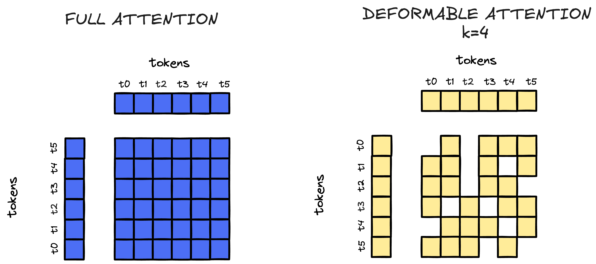

Imagine trying to learn a language by only seeing 25% of each sentence. That sounds like a terrible idea, right? Yet this is exactly what Vision Transformer Masked Autoencoders (ViT-MAE) do with images. The paper "Masked Autoencoders Are Scalable Vision Learners" by He et al. showed that hiding 75% of an image (by splitting it into patches and randomly masking 75% of them) and asking a model to reconstruct it produces remarkably powerful visual representations. It turns out that what you don't see can teach you a lot about what you do.

## Architecture Overview

ViT-MAE consists of three main components: patchification, an asymmetric encoder-decoder architecture, and a reconstruction loss. Let's break each down.

The following diagram illustrates the complete architecture and data flow:


<br>
<small><b>Figure 1:</b> The ViT-MAE architecture flow: (1) Input image with 75% of patches masked, (2) Visible patches are extracted and passed to the encoder, (3) Encoder processes only visible patches to produce rich embeddings, (4) Mask tokens are added for missing patches, (5) Decoder reconstructs all patches including masked ones, (6) Final reconstructed image with all patches filled in.</small>

### Patchification: Turning Images into Sequences

Vision Transformers treat images as sequences of patches, similar to how language models treat text as sequences of tokens. Each patch becomes a token that the transformer can attend to. Here's some code in `pytorch` to patchify an image:

```python
def patchify(x: Tensor, p: int = 16) -> Tensor:
    batch, channels, height, width = x.shape
    assert height % p == 0 and width % p == 0
    unfold = nn.Unfold(kernel_size=p, stride=p)
    patches = unfold(x).transpose(1, 2)
    return patches
```

For a 224x224 RGB image with 16x16 patches, we get 196 patches (14x14 grid). Each patch is flattened into a vector of size $3 \times 16 \times 16 = 768$ dimensions. The `Unfold` operation extracts these patches efficiently, and we transpose to get the sequence format `[batch, num_patches, patch_dim]`.

The reverse operation, `unpatchify`, reconstructs the image from patches:

```python
def unpatchify(patches: Tensor, p: int = 16, height: int = 224, width: int = 224) -> Tensor:
    batch, num_patches, patch_size = patches.shape
    fold = nn.Fold(output_size=(height, width), kernel_size=p, stride=p)
    x = fold(patches.transpose(1, 2))
    return x
```

### Random Masking: The Art of Hiding

The masking strategy is crucial. We randomly select which patches to keep and which to hide:

```python
def random_masking(num_patches: int, keep_ratio: float = 0.25):
    perm = torch.randperm(num_patches)
    keep = perm[:int(num_patches*keep_ratio)]
    mask = perm[int(num_patches*keep_ratio):]
    restore = torch.argsort(perm)
    return keep, mask, restore
```

The `restore` indices are the key here, since they let us reconstruct the original spatial order after processing. The encoder only sees patches at `keep` indices, while the decoder needs to reconstruct patches at `mask` indices in their original positions. This is why we need to sort the indices back to their original order after masking.

### Making Sense of the Visible: Encoders and Attention Mechanisms

The encoder is a standard Vision Transformer that processes only the visible patches:

```python
class Encoder(nn.Module):
    def __init__(self, patch_dim=768, d_e=1024, depth=12, heads=16, npos=196):
        super().__init__()
        self.patch_embed = nn.Linear(patch_dim, d_e)
        self.pos_e = nn.Parameter(torch.zeros(1, npos, d_e))
        self.blocks = nn.ModuleList([TransformerBlock(d_e, heads) for _ in range(depth)])

    def forward(self, patches, visible_indices):
        tokens = self.patch_embed(patches) + self.pos_e[:, visible_indices, :]
        visible_tokens = tokens
        for block in self.blocks:
            visible_tokens = block(visible_tokens)
        return visible_tokens
```

Notice that positional embeddings are only added for visible patches. The encoder learns to reason about spatial relationships from a sparse subset of the image. This is where the magic happens: by seeing only 25% of patches, the encoder **must** develop a rich understanding of visual structure, texture, and context to make sense of what it observes.

The transformer blocks use standard multi-head self-attention and feed-forward layers:

```python
class TransformerBlock(nn.Module):
    def __init__(self, d, heads=8, mlp_mult=4):
        super().__init__()
        self.pre_attention_norm = nn.LayerNorm(d)
        self.self_attention = MHSA(d, heads)
        self.pre_mlp_norm = nn.LayerNorm(d)
        self.feed_forward = MLP(d, mlp_mult)
    
    def forward(self, x):
        x = x + self.self_attention(self.pre_attention_norm(x))
        x = x + self.feed_forward(self.pre_mlp_norm(x))
        return x
```

There's another interesting transformer architecture that I wanted to implement (but I'm too lazy to do so) called _**Deformable Attention**_. This approach involves defining a hyperparameter, let's call it $k$, which specifies the number of tokens each attention head attends to.


In standard transformer attention (often called "full attention"), each query token attends to all input tokens in the sequence. For a sequence of length $n$, this means computing attention scores for all $n \times n$ pairs, resulting in $O(n^2)$ complexity. While this allows rich interactions between all tokens, it becomes computationally expensive for long sequences.

Deformable Attention addresses this by restricting each query token to attend to only $k$ tokens (where $k \ll n$), reducing the complexity to $O(n \times k)$. The key insight is that not all token interactions are equally important. By learning to select the most relevant $k$ tokens for each query, the model can maintain performance while dramatically reducing computational cost.

The following diagram illustrates the difference:


<br>
<small><b>Figure 2:</b> Left: In full attention, each query token (vertical axis) attends to all input tokens (horizontal axis), resulting in a dense attention matrix. Right: In deformable attention with <i>k=4</i>, each query token only attends to its four most relevant input tokens, resulting in a sparse pattern with adaptive focus. This sparsity enables scalable processing of long sequences by reducing computational complexity.</small>

In the left panel, you can see that full attention creates a dense $6 \times 6$ attention matrix where every query token (vertical axis) attends to every input token (horizontal axis). The right panel shows deformable attention with $k=4$, where each query token selectively attends to only 4 input tokens, creating a sparse attention pattern. Notice how the attention window shifts for different query tokens, since this "deformable" aspect allows the model to adaptively focus on the most relevant tokens for each position.

This approach is particularly valuable for vision transformers processing high-resolution images, where the number of patches can be very large. In a near future, I might implement this approach and compare the results with the standard attention mechanism.
### Reconstructing the Missing: Mask Tokens and Pixel Recovery

The decoder is where reconstruction happens. It's lighter than the encoder (typically 8 layers vs 12, and narrower: 512 vs 1024 dimensions) because its job is simpler: take the encoder's rich representations and reconstruct pixel values.

```python
class Decoder(nn.Module):
    def __init__(self, d_embedd=1024, d_decoder=512, depth=8, heads=8, 
                 npos=196, patch_dim=768):
        super().__init__()
        self.proj = nn.Linear(d_embedd, d_decoder)
        self.mask_token = nn.Parameter(torch.zeros(1, 1, d_decoder))
        self.pos_d = nn.Parameter(torch.zeros(1, npos, d_decoder))
        self.blocks = nn.ModuleList([TransformerBlock(d_decoder, heads) for _ in range(depth)])
        self.head = nn.Linear(d_decoder, patch_dim)

    def forward(self, visible_embeddings, visible_indices, masked_indices, restore_indices):
        batch_size = visible_embeddings.size(0)
        projected_embeddings = self.proj(visible_embeddings)
        
        num_patches = len(visible_indices) + len(masked_indices)
        full_sequence = projected_embeddings.new_zeros(batch_size, num_patches, 
                                                        projected_embeddings.size(-1))
        
        # Place visible embeddings
        full_sequence[:, visible_indices, :] = projected_embeddings
        
        # Place mask tokens for masked patches
        full_sequence[:, masked_indices, :] = self.mask_token.expand(
            batch_size, len(masked_indices), -1)
        
        # Restore spatial order and add positional embeddings
        full_sequence = full_sequence[:, restore_indices, :] + self.pos_d
        
        decoder_input = full_sequence
        for block in self.blocks:
            decoder_input = block(decoder_input)
        
        return self.head(decoder_input)
```

The decoder receives:
- **Visible embeddings**: Rich representations from the encoder
- **Mask tokens**: Learnable placeholders for missing patches
- **Positional embeddings**: Spatial information for all patches

The mask token is a single learnable vector that gets replicated for all masked positions. The decoder's attention mechanism allows mask tokens to attend to visible embeddings and other mask tokens, learning to reconstruct the missing content.

### The Loss: Learning What Matters

The loss function only penalizes reconstruction errors on masked patches. This is critical—if we also penalized visible patches, the model might just learn to copy them, defeating the purpose.

```python
def mae_loss(pred, target_patches, mask_idx, norm_pix_loss=True):
    if norm_pix_loss:
        # Normalize each patch by its mean and variance
        target_mean = target_patches[:, mask_idx, :].mean(dim=-1, keepdim=True)
        target_var = target_patches[:, mask_idx, :].var(dim=-1, keepdim=True, unbiased=False)
        target_normalized = (target_patches[:, mask_idx, :] - target_mean) / (target_var + 1e-6).sqrt()
        
        pred_mean = pred[:, mask_idx, :].mean(dim=-1, keepdim=True)
        pred_var = pred[:, mask_idx, :].var(dim=-1, keepdim=True, unbiased=False)
        pred_normalized = (pred[:, mask_idx, :] - pred_mean) / (pred_var + 1e-6).sqrt()
        
        return ((pred_normalized - target_normalized) ** 2).mean()
    else:
        return ((pred[:, mask_idx, :] - target_patches[:, mask_idx, :])**2).mean()
```

The `norm_pix_loss` option normalizes each patch by its mean and variance before computing the MSE. This helps because patches can have very different brightness levels. Normalizing focuses the model on learning **structure** rather than absolute pixel values. It's like asking the model to learn the shape of a house rather than its exact color.

## Why This Works

So, why is ViT-MAE such a show-off? Well, imagine trying to solve a 1000-piece puzzle while someone secretly swipes away 750 pieces. That's basically what we're making the model do! With only a tiny fraction of the image visible (just 25%), the poor AI can't just copy what's in front of it—it has to get creative and actually *understand* the big picture. No cheating allowed.

But here's the trick: we use a brainy, heavyweight encoder (think Einstein in running shoes) to squeeze meaning out of those few precious patches, while the decoder is a lightweight sidekick mostly around to help with the final reveal. Once training is done, we toss the decoder aside and let the encoder shine at new tasks.

And instead of playing complicated guessing games like contrastive learning, we just tell the model, “Hey, put those missing pixels back.” Simple as that. Transformers, our trusty backbone, really come into their own here, since understanding relationships far and wide in the image is pretty important when three-quarters of it has been vaporized.


## Putting It All Together

Here's the complete forward pass:

```python
class ViTMAE(nn.Module):
    def forward(self, x):
        # 1. Patchify
        patches = patchify(x, self.patch_size)
        
        # 2. Random masking
        keep, mask, restore = random_masking(self.num_patches, self.keep_ratio)
        keep = keep.to(x.device)
        mask = mask.to(x.device)
        restore = restore.to(x.device)
        
        # 3. Encode visible patches
        visible_patches = patches[:, keep, :]
        visible_embeddings = self.encoder(visible_patches, keep)
        
        # 4. Decode all patches
        reconstructed_patches = self.decoder(visible_embeddings, keep, mask, restore)
        
        return reconstructed_patches, patches, mask
```

During training, you compute the loss on masked patches and backpropagate. The encoder learns to extract meaningful features from partial observations, which transfer remarkably well to tasks like image classification, object detection, and semantic segmentation.

## The Bigger Picture

So there you have it. ViT-MAE takes the classic "learn by doing" philosophy and cranks it up to eleven by making the model learn by doing... well, almost nothing. 

What's remarkable is that this seemingly masochistic approach actually works. The model develops a deep understanding of visual structure, texture, and semantics, all without a single label to guide it. 

The approach has inspired numerous follow-ups and extensions, from video MAE to multimodal variants. Researchers keep finding new ways to make models suffer productively. But at its core, the idea remains beautifully simple: hide most of the data, and let the model figure out the rest. After all, if you can reconstruct 75% of an image from just 25%, you probably understand it pretty well. Or at least well enough to fool us humans, which is basically the same thing.

Next time you're struggling to understand something, maybe try covering up three quarters of it first. It worked for the transformers, and who knows? It might just work for you too.

