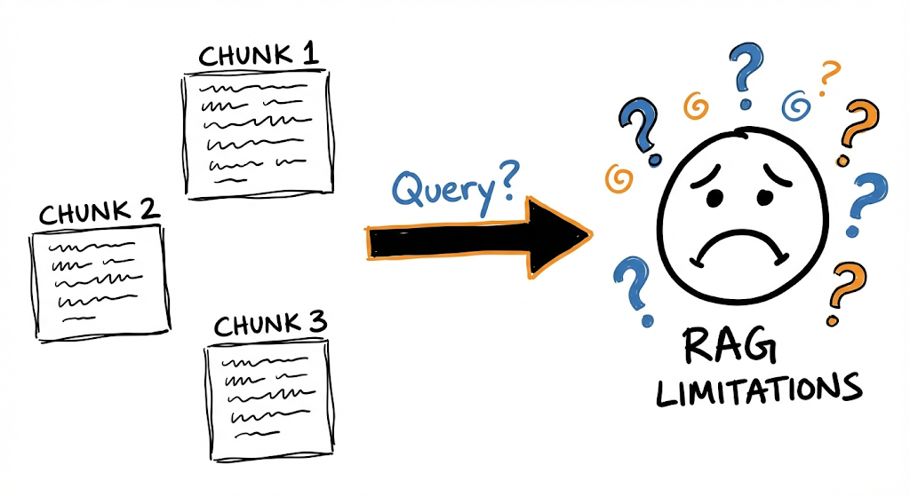
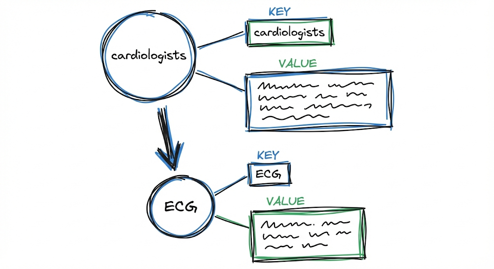

Hace unas semanas escribí sobre [GraphRAG](/es/posts/graph-rag/) y cómo cambió la manera de pensar la recuperación de información usando grafos de conocimiento. Fue un avance enorme porque dejó de depender exclusivamente de buscar texto parecido y empezó a entender relaciones implícitas entre entidades.

Pero después de implementarlo y usarlo en proyectos, me encontré con algunas fricciones. La más evidente es tener que elegir entre el modo "Local" y el modo "Global" antes de hacer una consulta. Eso funciona bien en teoría, pero en la práctica te obliga a pensar: "¿Esta pregunta necesita detalle puntual o síntesis amplia?". Y la respuesta muchas veces es "las dos cosas", lo cual te deja en un problema de diseño.

La otra fricción tiene que ver con la escalabilidad. Cuando la base de datos crece o cambia seguido, reconstruir los índices y mantener la coherencia del grafo se vuelve costoso y lento. No es un problema menor si estás trabajando con datos que se actualizan frecuentemente.

Ahí fue cuando empecé a investigar más sobre **LightRAG**. Lo que me llamó la atención no fue una funcionalidad revolucionaria aislada, sino cómo reorganiza lo que ya sabíamos hacer para que sea más fluido, más rápido y menos rígido. Este post es un análisis detallado de cómo funciona LightRAG por dentro, explicando cada componente y por qué representa un paso adelante en la evolución de los sistemas RAG.

---

## El problema con RAG tradicional

Antes de meternos en LightRAG, vale la pena entender bien qué limitaciones tiene RAG convencional. No es que quiera tirarlo abajo, porque funcionó y sigue funcionando para muchos casos de uso, sino para entender por qué necesitamos algo más.

La arquitectura clásica de RAG funciona así: tomás tus documentos, los dividís en fragmentos (chunks), generás embeddings de cada fragmento, y los guardás en una base vectorial. Cuando llega una consulta, la convertís en embedding, buscás los fragmentos más similares, y se los pasás al modelo como contexto para que genere una respuesta.

No hay mucha ciencia, la verdad. Es bastante simple. Pero tiene un problema estructural: **cada fragmento vive aislado**.

*Los fragmentos en RAG tradicional no tienen conexión entre sí, lo que dificulta sintetizar información distribuida.*

Si tu corpus (conjunto estructurado de textos) habla de autos eléctricos en un documento, de calidad del aire en otro, y de planificación de transporte público en un tercero, el sistema puede recuperar pedazos de cada uno cuando le preguntás cómo se relacionan. Pero esos pedazos no saben nada uno del otro. Son fragmentos que coinciden por similitud vectorial, pero no tienen ninguna estructura que los conecte semánticamente.

Suponete que le preguntás a tu sistemita una pregunta compleja (que yo creo que no podría responder): "¿Cómo influye el aumento de autos eléctricos en la calidad del aire urbano y en la infraestructura del transporte público?"

Un RAG convencional podría devolver los siguientes fragmentos:
- Uno sobre la adopción de autos eléctricos y sus beneficios
- Otro sobre niveles de contaminación en ciudades
- Otro sobre inversión en transporte público

Tres pedazos de información correctos individualmente, pero sin ninguna síntesis de cómo la adopción de autos eléctricos puede reducir emisiones, y cómo esa mejora en el aire puede influir en decisiones de planificación urbana que afectan al transporte público. Esto no sirve, estás recuperando información suelta que el modelo tiene que juntar por sí mismo, e incluso te puede llegar a tirar cualquier fruta (porque no tiene lo necesario para responder, el modelo tiene que llenar esos "blancos" que el sistema nunca conectó explícitamente).

Este problema se vuelve más grave cuando la pregunta requiere integrar información de muchas fuentes diferentes. No quiero sonar muy hater, no es que RAG como tal no funcione, sino que su arquitectura no está diseñada para ese tipo de consultas complejas.   

### Las dos limitaciones fundamentales

De todo esto, podemos resumir el problema en dos limitaciones estructurales:

**1. Representación plana del conocimiento:** Los chunks son unidades aisladas. No hay forma de saber si la "Empresa X" mencionada en el documento 3 es la misma que "la compañía" referenciada en el documento 7. Tampoco hay forma de seguir cadenas de relaciones, como "Juan trabaja en X, X produce Y, Y compite con Z".

**2. Falta de conciencia contextual:** Al recuperar fragmentos por similitud vectorial, el sistema prioriza coincidencias léxicas o semánticas superficiales. Puede traer texto que use palabras parecidas sin que sea relevante para la pregunta específica, y puede ignorar texto con formulaciones diferentes que sí contenga la respuesta.

GraphRAG atacó estas limitaciones usando grafos de conocimiento. LightRAG va más allá proponiendo una arquitectura más integrada y eficiente. Pero antes de ver cómo, necesitamos una forma clara de describir qué hace un sistema RAG.

---

## Formalización de un sistema RAG (saltealo si no te gustan las matemáticas)

Para entender bien qué hace diferente LightRAG, primero necesitamos una forma clara de describir cualquier sistema RAG. El paper propone una formalización matemática que resulta útil para comparar enfoques.

Un sistema RAG se puede representar como:

$$
\mathcal{M} = (\mathcal{G}, \mathcal{R})
$$

Donde:
- $\mathcal{M}$ es el sistema completo
- $\mathcal{G}$ es el **generador** (típicamente un LLM que redacta la respuesta)
- $\mathcal{R}$ es el **recuperador** (el componente que busca información relevante)

El recuperador $\mathcal{R}$ se descompone en dos funciones:
- $\varphi$: Transforma la base documental cruda $D$ en una representación apta para búsqueda $\hat{D}$
- $\psi$: Ejecuta la recuperación dada una consulta $q$

La operación completa de respuesta se expresa como:

$$
\mathcal{M}(q; D) = \mathcal{G}(q, \psi(q; \hat{D}))
$$

Donde $\hat{D} = \varphi(D)$ es la base procesada (el índice).

Esta formalización nos permite ver claramente dónde actúa cada componente. En RAG tradicional, $\varphi$ consiste en chunking + embeddings + indexación vectorial. En LightRAG, $\varphi$ es mucho más sofisticado: construye un grafo de conocimiento con entidades perfiladas.

Ahora que tenemos el marco teórico, veamos cómo LightRAG implementa esto en la práctica.

---

## Arquitectura de LightRAG: el pipeline de indexación

Acá es donde empiezan las diferencias importantes. LightRAG reemplaza la indexación plana (la de los RAG tradicionales) por un paradigma basado en grafos que busca capturar las interdependencias entre conceptos desde el momento de la indexación, antes de que llegue cualquier consulta.

*El pipeline de indexación transforma documentos en un grafo de conocimiento estructurado.*

El proceso tiene cuatro etapas principales: segmentación, extracción de entidades y relaciones, indexación y recuperación.

### 1. Segmentación de documentos

El primer paso es dividir los documentos en fragmentos $D_i$. Esto es similar a RAG tradicional: necesitás unidades procesables para que el LLM pueda analizarlas. El tamaño de fragmentación afecta tanto el costo (más fragmentos = más llamadas al LLM) como la calidad (fragmentos muy chicos pierden contexto, muy grandes dificultan la extracción precisa).

Hasta acá, nada nuevo. La diferencia viene en lo que hacemos con esos fragmentos.

### 2. Extracción de entidades y relaciones

Para cada fragmento $D_i$, un LLM identifica:
- **Entidades**: nombres, lugares, fechas, conceptos, eventos, cualquier cosa que pueda funcionar como nodo en un grafo
- **Relaciones**: vínculos explícitos entre entidades ("Juan trabaja en X", "X produce Y", "A es un tipo de B")

El paper formaliza esto como:

$$
V, E = \bigcup_{D_i \in D} \text{Recog}(D_i)
$$

Donde $\text{Recog}(D_i)$ es la función de reconocimiento que extrae el conjunto de vértices (entidades) y aristas (relaciones) de cada fragmento, y la unión $\cup$ combina los resultados de todos los fragmentos.

Por ejemplo, si el fragmento dice:

> "Los cardiólogos evalúan síntomas para identificar posibles problemas cardíacos. Si el dolor de pecho y la dificultad para respirar persisten, recomiendan un ECG y análisis de sangre."

La extracción produciría:

**Entidades:**
- Cardiólogos (tipo: profesional médico)
- Síntomas (tipo: concepto médico)
- Problemas cardíacos (tipo: condición médica)
- Dolor de pecho (tipo: síntoma)
- Dificultad para respirar (tipo: síntoma)
- ECG (tipo: procedimiento médico)
- Análisis de sangre (tipo: procedimiento médico)

**Relaciones:**
- Cardiólogos EVALÚAN Síntomas
- Síntomas INDICAN Problemas cardíacos
- Dolor de pecho ES_TIPO_DE Síntomas
- Dificultad para respirar ES_TIPO_DE Síntomas
- Cardiólogos RECOMIENDAN ECG
- Cardiólogos RECOMIENDAN Análisis de sangre

Este proceso se repite para cada fragmento del corpus completo.

### 3. Perfilado con pares Key-Value

Acá viene una de las ideas más interesantes de LightRAG. Una vez que tenés las entidades y relaciones extraídas, el sistema genera un **perfil** para cada una, expresado como un par clave-valor (key-value).

*Cada entidad y relación se transforma en un par key-value optimizado para recuperación.*

Para cada entidad y cada relación, se construye:
- **Key**: Una palabra o frase corta diseñada para recuperación eficiente (básicamente, términos de búsqueda optimizados)
- **Value**: Un párrafo textual que resume la evidencia relevante sobre esa entidad o relación, incluyendo snippets de la fuente original

Por ejemplo, para el nodo "Cardiólogos", el perfil podría ser:

**Key:** `"Cardiólogos"`

**Value:** `"Los cardiólogos son profesionales médicos especializados en evaluar síntomas cardiovasculares. Cuando se presentan síntomas persistentes como dolor de pecho y dificultad para respirar, recomiendan estudios diagnósticos como ECG y análisis de sangre. [Fuente: documento X, párrafo Y]"`

Para la relación "Cardiólogos RECOMIENDAN ECG", se pueden generar múltiples keys:

**Keys:** `["Cardiólogos ECG", "recomendación ECG", "diagnóstico cardíaco"]`

**Value:** `"Los cardiólogos recomiendan electrocardiogramas (ECG) como herramienta diagnóstica cuando los pacientes presentan síntomas persistentes de problemas cardíacos, particularmente dolor de pecho y dificultad respiratoria. [Fuente: documento X]"`

Esta transformación es muy importante. Al tener keys optimizadas para búsqueda y values con un contexto rico, el sistema puede recuperar información precisa y al mismo tiempo entregar contexto suficiente para generar respuestas relativamente coherentes.

La formalización del paper lo expresa como:

$$
\hat{D} = (\hat{V}, \hat{E}) = \text{Dedupe} \circ \text{Prof}(V, E)
$$

Donde $\text{Prof}$ es el perfilado y $\text{Dedupe}$ la deduplicación.

### 4. Deduplicación

El último paso del pipeline de indexación es identificar y fusionar entidades y relaciones duplicadas. Esto es importantísimo porque la misma entidad puede aparecer con distintos nombres en diferentes partes del corpus:

- "Problemas cardíacos" y "Cardiopatías" probablemente refieren al mismo concepto
- "Juan Cruz Giner" y "J. C. Giner" probablemente son la misma persona (y seguramente le guste mucho el café)
- "Fipi ES UN IPAD-KID" puede aparecer en muchos fragmentos

La deduplicación consolida estas variantes en un único nodo canónico, preservando los alias y fusionando las descripciones. Esto reduce el tamaño del grafo y mejora la eficiencia tanto en la indexación como en la recuperación posterior.

Con el pipeline de indexación completo, ya tenemos nuestro grafo construido. Ahora viene la pregunta obvia: ¿valió la pena todo este trabajo extra?

---

## Las ventajas de indexar con grafos

Antes de pasar a la recuperación de los textos (retrieval), tomemos un descanso de 30 segundos. Pensemos por qué todo este quilmbo (que hasta ahora parece un poco excesivo) vale la pena... 

Si no se te ocurrió, te lo spoileo.
> Tenemos 2 ventajas principales: la comprensión de información y la recuperación.

### Comprensión de información distribuida

Al tener estructuras de grafo, el sistema puede extraer información que atraviesa múltiples fragmentos siguiendo caminos de relaciones entre entidades. 

Volviendo al ejemplo de los autos eléctricos, si el grafo tiene:
>- Nodo "autos eléctricos" conectado a "Reducción de emisiones"
>- "Reducción de emisiones" conectado a "Calidad del aire urbano"
>- "Calidad del aire urbano" conectado a "Planificación urbana"
>- "Planificación urbana" conectado a "Transporte público"

Ahora el sistema puede responder la pregunta original siguiendo el camino del grafo, integrando información de fuentes que individualmente nunca mencionaban todos estos conceptos juntos.

### Recuperación rápida y precisa

Los pares key-value derivados del grafo están optimizados para búsqueda vectorial. En lugar de buscar sobre chunks de texto genéricos (que pueden traer falsos positivos por coincidencias léxicas superficiales), buscás sobre keys diseñadas específicamente para matchear con tipos específicos de consultas.

Además, el matching es sobre entidades y relaciones conceptuales, no sobre texto crudo. Esto reduce significativamente el **ruido** en la recuperación.

La razón técnica de esto es que los embeddings de fragmentos o chunks funcionan como un promedio de todo el contenido de ese fragmento.

> Por ejemplo, si un chunk tiene 300 palabras donde 250 hablan sobre la historia de un hospital y 50 palabras mencionan que ahí se realiza un tratamiento específico, en RAG Tradicional el vector de ese chunk va a estar "diluido" o dominado por el tema de la historia del hospital. Si buscás sobre el tratamiento, la señal es débil y trae mucho "ruido" (el resto del texto irrelevante).

En LightRAG, en cambio, se extrae la relación específica Hospital X REALIZA Tratamiento Y. Se genera un vector exclusivo para esa relación.
Al matchear la pregunta contra un concepto destilado y puro, y no contra una bolsa de palabras mezcladas donde el tema principal tapa a los detalles importantes, reducís el ruido.

Pero hay otro problema que no mencionamos todavía: ¿qué pasa cuando tu corpus cambia?

---

## Actualización incremental del grafo

Un problema enorme con GraphRAG (y con cualquier sistema de indexación pesada) es qué hacer cuando llegan documentos nuevos. Si tenés que reconstruir todo el índice cada vez que agregás un documento, el sistema se vuelve impráctico para escenarios donde los datos cambian frecuentemente.

*LightRAG permite agregar nuevos documentos sin reconstruir el grafo completo.*

LightRAG resuelve esto con una estrategia de **actualización incremental**. Cuando llega un documento nuevo $D'$, el sistema:

>1. Aplica el mismo pipeline de indexación para producir $\hat{D}' = (\hat{V}', \hat{E}')$
>2. Integra el nuevo grafo con el existente: $\hat{V} \cup \hat{V}'$ y $\hat{E} \cup \hat{E}'$
>3. Ejecuta deduplicación para fusionar entidades que ya existían

Lo interesante acá es que no necesitás reconstruir el grafo completo. Las entidades y relaciones nuevas se suman a la estructura existente, y la deduplicación se encarga de mantener la coherencia si hay superposición con conocimiento previo.

Esto tiene dos beneficios concretos:
- **Costo computacional reducido**: Solo procesás lo nuevo, no todo
- **Integración sin disrupción**: El conocimiento histórico se preserva y sigue siendo accesible mientras se incorpora información nueva

Ya vimos cómo se construye el grafo y cómo se actualiza. Ahora viene la parte más interesante: cómo LightRAG usa todo esto para responder preguntas.

---

## Paradigma de recuperación de doble nivel

Ahora llegamos a la otra innovación fundamental de LightRAG: cómo recupera información cuando llega una consulta.

GraphRAG te obliga a elegir entre búsqueda "Local" (orientada a entidades específicas) y búsqueda "Global" (orientada a síntesis de alto nivel). LightRAG propone que ambas estrategias coexistan dentro de la misma ejecución, sin necesidad de elegir una ruta explícita.

*LightRAG ejecuta recuperación de bajo y alto nivel en paralelo, sin forzar una elección.*

### Nivel bajo (Low-Level): Consultas específicas

Algunas consultas son bastantes directas. "¿Quién escribió El Eternauta?" necesita un dato puntual: el nombre de una persona asociada a una entidad específica (el libro).

El nivel bajo de recuperación se enfoca precisamente en esto:
- Encontrar entidades específicas mencionadas o implicadas en la consulta
- Recuperar sus atributos directos
- Recuperar las relaciones inmediatas en las que participan

### Nivel alto (High-Level): Consultas abstractas

Otras consultas son más amplias. "¿Cómo influye la inteligencia artificial en la educación moderna?" no apunta a un dato puntual, sino a un patrón, una síntesis, un tema que atraviesa múltiples entidades y contextos.

El nivel alto de recuperación aborda esto agregando información a través de múltiples entidades y relaciones, proporcionando insights sobre conceptos de orden superior en lugar de datos específicos.

### Cómo funcionan juntos

Para cada consulta $q$, el algoritmo:

>1. **Extrae keywords de dos tipos:**
>   - Keywords locales $k^{(l)}$: términos específicos, nombres de entidades, datos puntuales
>   - Keywords globales $k^{(g)}$: señales temáticas, patrones relacionales, conceptos abstractos
>
>2. **Ejecuta búsqueda vectorial:**
>   - Las keywords locales se matchean contra **entidades** candidatas en la base vectorial
>   - Las keywords globales se matchean contra **relaciones** asociadas a claves globales
>
>3. **Expande el contexto estructural:**
>   - Para cada elemento recuperado (sea entidad o relación), el sistema incorpora sus **vecinos a un salto** en el grafo
>   - Esto introduce contexto inmediato sin explotar exponencialmente la cantidad de información

Formalmente, la expansión recolecta el conjunto:

$$
\{v_i \mid v_i \in V \land (v_i \in N_v \lor v_i \in N_e)\}
$$

Donde $N_v$ y $N_e$ representan los vecinos a un salto de los nodos y aristas recuperados respectivamente.

Esto evita que la recuperación quede limitada a elementos aislados. Si recuperás la entidad "ECG" porque matcheó con una keyword, también te traés las relaciones en las que participa (quién lo recomienda, para qué se usa, qué indica) y las entidades conectadas. El contexto se enriquece automáticamente.

Con el contexto armado, solo falta un paso: generar la respuesta.

---

## Generación de respuesta

Con el contexto recuperado, llega el momento de generar la respuesta. Pero acá también hay una diferencia importante respecto a RAG tradicional.

En RAG convencional, el contexto que le pasás al LLM son fragmentos de texto crudos, directamente como aparecen en los documentos originales. El modelo tiene que hacer sentido de ese texto, extraer lo relevante, y formular una respuesta coherente.

En LightRAG, el contexto consiste en los **values** de las entidades y relaciones recuperadas. Estos values ya fueron procesados y optimizados durante la indexación, y contienen nombres y descripciones claras de entidades, descripciones de relaciones con contexto, extractos del texto original que funcionan como evidencia y referencias a las fuentes.

El LLM recibe información ya estructurada alrededor de entidades y vínculos. No tiene que parsear texto crudo y extraer lo importante porque eso ya está hecho. Su trabajo se simplifica a tomar esa información pre-digerida y formularla como una respuesta coherente a la consulta.

Esto reduce significativamente el riesgo de que el modelo "alucine" o invente información. El contexto que recibe está bien definido, tiene referencias, y está organizado semánticamente.

Habiendo visto todo el pipeline de LightRAG, es natural preguntarse: ¿en qué se diferencia concretamente de GraphRAG?

---

## LightRAG vs GraphRAG

Después de entender cómo funciona LightRAG, lo natural es compararlo con GraphRAG, porque a simple vista los dos usan grafos. La diferencia está en cómo te hacen llegar a la evidencia cuando la pregunta es medio tramposa y necesita detalle y también panorama.

### Separación vs unificación de modos

En GraphRAG, hay dos caminos:

> El modo **local**, donde si preguntás por algo concreto, se para en ese nodo, mira vecinos cercanos y trae fragmentos relacionados, y el modo **global**, donde primero arma comunidades en el grafo, después genera resúmenes por comunidad, y recién ahí usa un esquema tipo map-reduce para sintetizar una respuesta amplia.

El tema es que en la práctica muchas preguntas no vienen limpias. A veces querés un hecho y también la explicación alrededor. Y ahí GraphRAG te obliga a decidir entre local o global. Si elegís mal, terminás corriendo el otro modo también y costandote el doble en latencia y complejidad.

LightRAG justamente apunta a evitar esa decisión. Para cada consulta genera dos grupos de keywords, unas más locales y otras más globales, y recupera ambas cosas en paralelo. Trae entidades y relaciones relevantes al mismo tiempo, y después suma contexto con expansión a vecinos a un salto. Vos no tenés que elegir el modo, el sistema mezcla evidencia puntual y evidencia de contexto cuando hace falta.

Esto hace que LightRAG sea más directo cuando la pregunta mezcla detalle con explicación, porque no te manda a un pipeline aparte para entrar en modo "global".

---

## Conclusión

LightRAG representa una evolución significativa en la forma de diseñar sistemas RAG con grafos de conocimiento. Toma las ideas fundamentales que introdujo GraphRAG y las reorganiza en una arquitectura más fluida y práctica.

Como cualquier sistema, no es perfecto ni universal. Tiene un costo de indexación mayor que RAG tradicional (tenés que extraer entidades, generar perfiles, construir el grafo). Pero ese costo upfront se paga una vez y después se amortiza en cada consulta con mejor precisión y coherencia.

Si estás trabajando con corpus complejos, interconectados o dinámicos, LightRAG ofrece un framework sólido para explorar.

Pero hay algo que LightRAG todavía no resuelve: **el contenido multimodal**. Los documentos reales no son solo texto. Tienen imágenes, tablas, gráficos, diagramas, PDFs con layouts complejos. LightRAG, al igual que GraphRAG, asume que tu entrada es texto plano. Si tenés un paper con una figura clave que explica la arquitectura, o una tabla con datos comparativos, esa información se pierde en el pipeline de indexación.

Esto no es un defecto menor. En muchos dominios (medicina, ingeniería, investigación científica), la información visual es tan importante como el texto. Un sistema RAG que ignora eso está dejando conocimiento valioso afuera.

**Y acá es donde entra RAG Anything.** Es un enfoque que extiende las ideas de LightRAG para manejar documentos multimodales de manera nativa. En el próximo post vamos a analizar cómo funciona, qué arquitectura propone, y por qué representa el siguiente paso lógico en la evolución de los sistemas RAG.

---

**Referencia:**
Guo, Z., et al. (2024). *LightRAG: Simple and Fast Retrieval-Augmented Generation*. arXiv preprint arXiv:2410.05779. Disponible en: [https://arxiv.org/abs/2410.05779](https://arxiv.org/abs/2410.05779)
