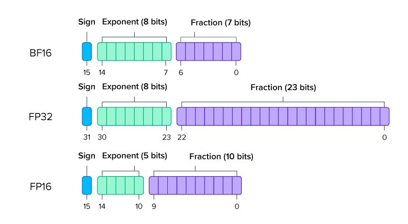
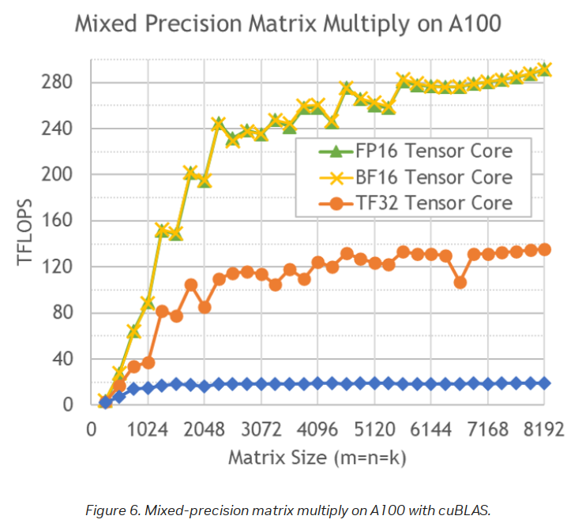
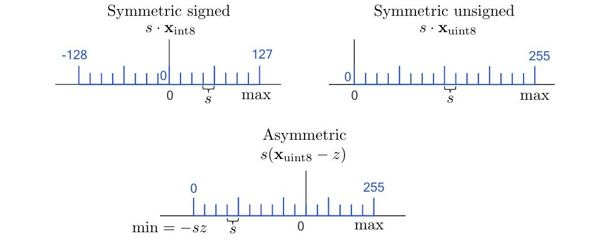

---
title: "Entrenamiento a Gran Escala: FSDP, QLoRA, y más."
date: 2025-09-13T00:00:00Z
draft: false
type: post
language: "es"
author: "Juan Francisco Lebrero"
description: ""
tags: ["LoRA", "QLoRA", "LLMs", "finetuning", "cuantización", "4-bit", "deepspeed", "fsdp", "zero", "precisión", "JAX", "bfloat16", "fp16", "train-at-scale"]
categories: ["IA", "LLMs"]
math: true
---   


Para poder entrenar modelos a gran escala, necesitamos entender diversos conceptos que nos van a ayudar a optimizar el rendimiento y la estabilidad del entrenamiento. Por eso, vamos a ver conceptos como precisión numérica, paralelización de datos, cuantización, LoRA, y más.


## Precisión numérica


La elección del formato numérico (FP32, FP16, BF16, FP8, INT8, etc.) constituye uno de los factores más determinantes para el rendimiento, el uso de memoria y la estabilidad del entrenamiento de modelos de gran escala. Por eso, es importante entender como funciona la precisión numérica y como afecta al rendimiento de los modelos, lo que se explicará en esta sección.


### ¿Por qué Importa la Precisión?


¿Como representarías el número $\pi$, un número con decimales INFINITOS, en algo FINITO como lo es una computadora? De está pregunta, surge como respuesta el punto flotante.

Los números representados con punto flotante representan, de manera aproximada, a los números reales, y lo hacen con dos componentes clave: la _mantisa_ y el _exponente_.


Un número en punto flotante representa aproximadamente un valor real mediante la fórmula:


$$\text{valor} \approx \text{signo} \times \text{mantisa} \times \text{base}^{\text{exponente}}$$


donde:
- **Mantisa**: Controla la resolución fina (cuántos pasos discretos entra en el intervalo 1.0 - 2.0)
- **Exponente**: Determina el rango dinámico (qué tan grandes o pequeños pueden ser los números representables)
- **Base**: En IEEE 754 es 2.


Más bits para la mantisa $\rightarrow$ mayor precisión

Más bits para el exponente $\rightarrow$ mayor rango


<figure>
 
 <figcaption style="text-align: center; font-size: 0.95em; color: #666;">
   Figura 1. Esquema de la representación de un número en punto flotante de 32 bits (FP32) según el estándar IEEE 754. <br>
  
 </figcaption>
</figure>


Pero, ¿por qué nos interesa a nosotros? 


Bueno, hay tres razones principales por las que la precisión numérica es crucial en el entrenamiento de modelos de gran escala:


- **Eficiencia computacional**: Los formatos de menor ancho de bits aceleran el cómputo en Tensor Cores/TPUs y reducen bastante el uso de memoria.


- **Estabilidad numérica**: Básicamente, si el formato de número no tiene suficiente rango o detalle, los números pueden volverse demasiado grandes, demasiado chiquitos o perder precisión, lo que puede causar errores o resultados raros durante el entrenamiento.


- **Escabilidad**: Cuando entrenamos LLMs a gran escala, aprovechar la precisión mixta es crucial para que el costo computacional no se nos vaya a la luna.

<figure>
 
 <figcaption style="text-align: center; font-size: 0.95em; color: #666;">
   Figura 2. Comparación visual de los formatos de punto flotante más utilizados en deep learning: <b>BF16</b>, <b>FP32</b> y <b>FP16</b>. <br>
  
 </figcaption>
</figure>


### FP32 (IEEE 754, precisión simple)

Este es el formato “normal” que se usa casi siempre. Guarda los números usando 1 bit para el signo, 8 para el exponente y 23 para la parte decimal (mantisa). Puede representar números muy chicos y muy grandes, desde $1.18\times10^{-38}$ hasta $3.4\times10^{38}$, y su precisión es muy alta ($\varepsilon \approx 1.19\times10^{-7}$).

En machine learning, FP32 es lo que se considera “precisión completa”. Incluso cuando usamos otros formatos para ahorrar memoria, los cálculos importantes (como acumular los gradientes) se hacen en FP32 para que el entrenamiento no se vuelva inestable.


### FP16 (IEEE 754, half)

FP16 es un formato de número que usa menos memoria y permite que todo vaya más rápido. Básicamente, guarda los números usando menos bits que el formato normal (FP32), así que ocupa menos espacio y acelera los cálculos.

Lo bueno: hace que entrenar y usar modelos sea más rápido y barato. Lo malo: como tiene menos detalle y menos rango, a veces los números muy chicos pueden desaparecer (por eso se suele usar <a href="https://picdictionary.com/ml-dictionary/loss-scaling-in-ai-and-deep-learning" target="_blank" rel="noopener">loss scaling</a> para evitarlo), y si los números son muy grandes, se pueden "saturar" y perder información.


### BF16 (Brain Floating Point)

BF16 es el formato que más se usa hoy para entrenar modelos grandes en TPUs y GPUs modernas (como la H100). 

Guarda los números de una forma parecida a FP32 (el formato “normal”), pero con menos detalle en los decimales. Lo importante es que puede representar números igual de grandes o chicos que FP32, así que no se “rompe” con números extremos. Además, casi siempre funciona bien sin tener que hacer trucos raros como el _loss scaling_. Aunque no tiene tanta precisión en los decimales como FP16, para entrenar modelos grandes (como los LLMs) suele ser suficiente y no da problemas.


## Comparación de precisiones


Para comparar las precisiones, voy a usar JAX, un framework de ML hecho por Google, que permite realizar operaciones de manera eficiente en GPUs y TPUs. La razón de utilizar JAX y no PyTorch, por ejemplo, es que JAX nos permitirá más adelante ver en "crudo" la paralelización de las operaciones y la optimización de la memoria.


Primero, importamos JAX y vemos la versión y el backend, así como los dispositivos disponibles:


```python
import jax
# Configuración de JAX
print(f"JAX version: {jax.__version__}")
print(f"JAX backend: {jax.default_backend()}")
print(f"Available devices: {jax.devices()}")
```


Necesitamos funciones para obtener el uso de memoria y medir el tiempo de ejecución. Para esto, vamos a usar `psutil`, `tracemalloc` y `time`.


```python
import jax.numpy as jnp
import psutil
import tracemalloc
import time


def get_memory_usage():
   """Obtiene el uso actual de memoria en MB"""
   process = psutil.Process()
   return process.memory_info().rss / 1024 / 1024


def measure_memory_and_time(func):
   def wrapper(*args, **kwargs):
       tracemalloc.start()
       start_memory = get_memory_usage()
      
       start_time = time.time()
       result = func(*args, **kwargs)
       jax.block_until_ready(result)
       end_time = time.time()
      
       end_memory = get_memory_usage()
       current, peak = tracemalloc.get_traced_memory()
       tracemalloc.stop()
      
       return {
           'result': result,
           'execution_time': end_time - start_time,
           'memory_delta': end_memory - start_memory,
           'peak_memory': peak / 1024 / 1024,
           'current_memory': current / 1024 / 1024
       }
   return wrapper
```


Ahora, vamos a medir el rendimiento y la memoria de la multiplicación de matrices y la "red neuronal". Para esto, vamos a usar el decorador `measure_memory_and_time` que definimos anteriormente.


```python
@measure_memory_and_time
def matrix_multiplication_test(dtype, shape):
   """Prueba de multiplicación de matrices con precisión dada"""
   key = jax.random.PRNGKey(42)
   key1, key2 = jax.random.split(key)
  
   def matmul_operation():
       a = jax.random.normal(key1, shape, dtype=dtype)
       b = jax.random.normal(key2, shape, dtype=dtype)
       return jnp.dot(a, b)
  
   return matmul_operation()


@measure_memory_and_time
def neural_network_forward_pass_test(dtype, input_size, hidden_size, output_size):
   """Prueba de pase forward de red neuronal simple"""
   key = jax.random.PRNGKey(123)
   keys = jax.random.split(key, 3)
  
   def nn_forward():
       # Inicialización de pesos
       W1 = jax.random.normal(keys[0], (input_size, hidden_size), dtype=dtype)
       b1 = jax.random.normal(keys[1], (hidden_size,), dtype=dtype)
       W2 = jax.random.normal(keys[2], (hidden_size, output_size), dtype=dtype)
       b2 = jax.random.normal(keys[2], (output_size,), dtype=dtype)
      
       # Datos de entrada
       x = jax.random.normal(keys[0], (input_size,), dtype=dtype)
      
       # Pase forward
       h = jnp.tanh(jnp.dot(x, W1) + b1)
       y = jnp.dot(h, W2) + b2
      
       return y
  
   return nn_forward()
```
Para correr las pruebas, simplemente llamamos a las funciones `matrix_multiplication_test` y `neural_network_forward_pass_test` con los tipos de precisión y las dimensiones de las matrices y la red neuronal, por ejemplo:


```python
matrix_multiplication_test(jnp.float16, (5000, 5000))
neural_network_forward_pass_test(jnp.float16, 784, 256, 10)
```

Para correr las pruebas, voy a incluir también FP64, para mostrar algo que puede ser contraintuitivo.

Dependiendo en qué hardware las estemos corriendo, los resultados pueden variar bastante. 
Corriendo las pruebas en un M1, obtenemos los siguientes resultados. Tiempo en segundos y memoria en MB:

<div style="display: flex; gap: 2px; flex-wrap: wrap;">

<div style="flex: 1; min-width: 300px;">

**Multiplicación de matrices:**

| Precisión | Tiempo | Memoria Pico |
| --------- | ---------- | ----------------- |
| FP16      | 1.024      | 0.013             |
| BF16      | 0.978      | 0.008             |
| FP32      | 0.943      | 0.008             |
| FP64      | **0.928**      | 0.009             |

</div>

<div style="flex: 1; min-width: 300px;">

**Red neuronal:**

| Precisión | Tiempo | Memoria Pico |
| --------- | ---------- | ----------------- |
| FP16      | 0.007      | 0.020             |
| BF16      | 0.004      | 0.015             |
| FP32      | 0.003      | 0.015             |
| FP64      | **0.002**      | 0.016             |

</div>

</div>

A simple vista, uno pensaría que este blog no sirve de nada y que todo lo que dije es una farsa porque "FP64 dio mejor". Pero en realidad no es así. Estos resultados se explican por varios factores:

1. **CPUs están optimizadas para ciertos tipos**: Los procesadores como el M1 funcionan mejor con FP32 y FP64 porque las librerías que usan (como Accelerate en Mac) están hechas para esos formatos. En cambio, FP16 y BF16 no están tan bien soportados en CPU, así que muchas veces el sistema tiene que convertirlos a FP32 o FP64 antes de hacer las cuentas, y eso las hace más lentas cuando el problema es chico.

2. **El tamaño importa**: En los ejemplos de las tablas, las matrices y redes son chicas. Cuando los datos son pequeños, la mayor parte del tiempo se va en preparar todo (inicializar, convertir tipos, sincronizar), no en hacer las cuentas en sí. Por eso, a veces FP64 parece “más rápido”, pero es porque el camino para ese tipo es más directo y está mejor optimizado.

3. **En GPU es al revés**: En las GPUs, FP16 y BF16 son mucho más rápidos porque el hardware tiene partes especiales (como Tensor Cores en NVIDIA) que están hechas para trabajar con estos formatos de baja precisión y pueden hacer muchas operaciones a la vez, usando menos memoria y ancho de banda.


Para que lo comprueben ustedes mismos, si se ejecutan las pruebas en una GPU usando matrices de dimensiones mucho mayores, se va a ver la diferencia. A continuación muestro una gráfica que la ilustra claramente medido en TFLOPS (Teraflops), calculado como el número de operaciones de punto flotante por segundo.


<div style="display: flex; justify-content: center;">
  <figure>
    
    <figcaption style="text-align: center; font-size: 0.95em; color: #666;">
      Figura 3. Comparación de precisiones. <br>
    </figcaption>
  </figure>
</div>


Por útimo, a modo de conclusión de esta sección, les dejo un ejemplo de implementación de precisión mixta, que es lo que suele hacerse en la práctica para entrenar modelos a gran escala.

La idea central es simple: las partes del modelo que requieren estabilidad numérica se calculan en FP32, mientras que los resultados intermedios, gradientes y parámetros se almacenan en FP16 o BF16, aprovechando así el ahorro de memoria y el mayor throughput del hardware.


```python
def mixed_precision_forward_pass(x, W, b):
   # Convertir a FP32 para cómputo
   x_fp32 = x.astype(jnp.float32)
   W_fp32 = W.astype(jnp.float32)
   b_fp32 = b.astype(jnp.float32)
  
   # Pase forward
   y = jnp.dot(x_fp32, W_fp32) + b_fp32
  
   # Convertir de vuelta a FP16 para eficiencia de memoria
   return y.astype(jnp.float16)
```


# Cuantización


Cuando entrenamos modelos, solemos utilizar FP32 para los pesos y FP16 para los gradientes, pero al llevar el modelo a producción surge un desafío: necesitamos reducir el consumo de memoria y la latencia sin sacrificar la calidad. Acá entra en juego la cuantización. Este proceso consiste en representar los pesos y activaciones con menos bits, lo que permite ahorrar memoria y acelerar la inferencia, a cambio de introducir un pequeño error numérico controlado.

Hay 2 enfoques principales: Post Training Quantization (PTQ) y Quantization Aware Training (QAT).


<div style="display: flex; flex-direction: column; align-items: center; margin: 2em 0;">
  
  <p style="text-align: center; margin-top: 0.5em; color: #555;">
    Figura 4. Comparación visual entre QAT (Izquierda) y PTQ (Derecha).
  </p>
</div>


## Post Training Quantization (PTQ)
La cuantización post entrenamiento, **PTQ**, toma un modelo ya entrenado y convierte pesos y activaciones a formatos de menor precisión sin volver a entrenar. La mayoría de las veces es suficiente.

Matemáticamente, si partimos de un valor real $x\in\mathbb{R}$ en FP32, la cuantización clásica mapea $x$ a un entero $q$ de $b$ bits mediante una escala $s$ y un zero point $z$:

$$
q = \operatorname{clip}\Big(\operatorname{round}\big(\tfrac{x}{s}\big) + z,\; q_{\min}, q_{\max}\Big),
$$

y para reconstruir en reales usamos

$$
\hat{x} = s\cdot (q - z).
$$

El rango entero $[q_{\min},q_{\max}]$ depende de si usamos representación signada o no. Para $b$ bits signados, típicamente $q_{\min}=-2^{b-1}$ y $q_{\max}=2^{b-1}-1$. La elección de $s$ y $z$ define cuánto error agregamos. 

Si queremos cubrir un intervalo real $[\alpha,\beta]$ la escala práctica es:

$$
s=\frac{\beta-\alpha}{q_{\max}-q_{\min}},
\qquad
z=\operatorname{round}\Big(\frac{-\alpha}{s}\Big)+q_{\min}.
$$

Dependiendo del valor de $z$, la cuantización puede ser simétrica o asimétrica. En la simétrica se fija $z=0$ y se toma $s=\tfrac{\max|x|}{q_{\max}}$, de modo que el rango entero queda centrado alrededor de cero. En cambio, si la distribución de los valores está sesgada, la cuantización asimétrica con $z\neq 0$ desplaza el rango y aprovecha mejor los niveles representables.

En python podríamos implementar algo así:

```python
import jax.numpy as jnp

def quantize_tensor(x, num_bits=8, signed=True, eps=1e-8):
    if signed:
        qmin = - (2 ** (num_bits - 1))
        qmax = 2 ** (num_bits - 1) - 1
    else:
        qmin = 0
        qmax = 2 ** num_bits - 1

    x_min = jnp.min(x)
    x_max = jnp.max(x)

    scale = (x_max - x_min) / (qmax - qmin + eps)
    scale = jnp.where(scale == 0, 1.0, scale)

    zero_point = jnp.round(qmin - x_min / (scale + eps))
    zero_point = jnp.clip(zero_point, qmin, qmax)

    q = jnp.clip(jnp.round(x / (scale + eps) + zero_point), qmin, qmax).astype(jnp.int32)
    x_hat = scale * (q.astype(jnp.float32) - zero_point)

    return q, x_hat, float(scale), int(zero_point)
```


Para cuantizar parámetros suele bastar con usar los mínimos y máximos por tensor o por canal, porque en general sus distribuciones están centradas. Con activaciones la situación es distinta: una ReLU, por ejemplo, devuelve solo valores no negativos, lo que sesga la distribución hacia el lado positivo. En ese caso, una cuantización simétrica desperdicia la mitad de los niveles en valores negativos vacíos. Por eso se usa cuantización asimétrica (o directamente unsigned) junto con un conjunto de calibración que permita estimar rangos representativos y evitar saturaciones por outliers.

En PTQ el paso crítico es calibrar correctamente las activaciones. Una estrategia común es usar percentiles para que unos pocos valores extremos no definan toda la escala. Otra es aplicar clipping, aceptando un ligero sesgo a cambio de reducir errores de saturación. 


<div style="display: flex; flex-direction: column; align-items: center; margin: 2em 0;">
  
  <p style="text-align: center; margin-top: 0.5em; color: #555;">
    Figura 5. Comparación entre cuantización simétrica y asimétrica.
  </p>
</div>

PTQ es rápido y útil cuando la caída de desempeño es chiquita; si no alcanza, se recurre a QAT.


## Quantization Aware Training (QAT)

El objetivo de QAT es entrenar un modelo sabiendo que, en inferencia, sus pesos y activaciones van a pasar por un cuantizador. Escribo el problema así:

<div class="math">$$
\min_{w}\ \mathbb{E}_{(x,y)\sim\mathcal{D}}\Big[L\big(f_{q(w)}(x),\,y\big)\Big].
$$</div>

$w$ es el conjunto completo de parámetros reales del modelo antes de cuantizar. $x$ es una entrada del dataset y $y$ es su etiqueta o valor objetivo. $\mathcal{D}$ es la distribución de datos que genera los pares $(x,y)$. $\mathbb{E}$ es la esperanza sobre esa distribución. $f_{q(w)}$ es el mismo modelo que usarías en FP32 pero con sus pesos pasados por un operador de cuantización $q(\cdot)$. $L(\hat y,y)$ es la función de costo que compara la predicción $\hat y=f_{q(w)}(x)$ con el objetivo $y$. Puede ser entropía cruzada, error cuadrático medio u otra diferenciable respecto de las salidas del modelo.

Si definiera $q(w)$ de forma literal con redondeo y recorte, el objetivo sería no diferenciable. Ese cuantizador uniforme afín es

<div class="math">$$
q=\operatorname{clip}\!\big(\operatorname{round}(u),\,q_{\min},\,q_{\max}\big),\qquad
u=\frac{w}{s}+z,\qquad
\tilde w=s\,(q-z).
$$</div>

donde $u=\tfrac{w}{s}+z$ es la versión escalada y desplazada de $w$ para pasar por el cuantizador, $s>0$ es la escala y $z$ es el zero point que alinea el cero real con un entero. $[q_{\min},q_{\max}]$ es el rango entero permitido por el ancho de bits. $\tilde w$ es la versión de $w$ de-cuantizada que se usa para computar la salida y la pérdida. El forward siempre se hace con $\tilde w$, no con $w$ directo.

Como $\operatorname{round}$ y $\operatorname{clip}$ no son diferenciables en sentido estricto, QAT usa el estimador <a href="https://hassanaskary.medium.com/intuitive-explanation-of-straight-through-estimators-with-pytorch-implementation-71d99d25d9d0" target="_blank">straight through</a> en el backward. La idea es dejar pasar gradiente como si el redondeo fuera la identidad y hacer que el clip tenga derivada uno dentro del rango útil y cero en saturación. Con $u=\tfrac{w}{s}+z$ queda

<div class="math">$$
\frac{\partial \tilde w}{\partial w}\ \approx\ 
\begin{cases}
1 & \text{si } q_{\min} < u < q_{\max} \\
0 & \text{en caso contrario}
\end{cases}
$$</div>

En otras palabras: mientras el valor $u$ no se pase de los límites del cuantizador, el gradiente se transmite normalmente, como si no hubiera cuantización. Pero si $u$ se sale del rango (por ejemplo, porque $w$ es muy grande o muy chico), el gradiente se bloquea y no pasa. Así, el modelo aprende a mantener los valores dentro del rango útil del cuantizador, y solo se "corta" el gradiente cuando hay saturación.

Si además se decide aprender la escala, se trata $s$ como parámetro y se usa otra vez STE. Reescribiendo $q\approx \operatorname{clip}(u,q_{\min},q_{\max})$ para propagar gradiente, una forma clara del término es

<div class="math">$$
\frac{\partial \tilde w}{\partial s}\ \approx\ 
\begin{cases}
-\,z\;-\;\frac{w}{s} & \text{si } q_{\min} < u < q_{\max} \\
\operatorname{clip}(u,\,q_{\min},\,q_{\max})\;-\;z\;-\;\frac{w}{s} & \text{en caso contrario}
\end{cases}
$$</div>


En la práctica este gradiente se normaliza por la cantidad de elementos que comparten la misma escala, lo que estabiliza la actualización. Acá aparece el concepto per-tensor y per-channel. 

Considerá una capa lineal con pesos $W\in\mathbb{R}^{C_o\times C_i}$ que recibe activaciones $X\in\mathbb{R}^{T\times C_i}$, donde $T$ es la cantidad de tokens, $C_i$ los canales de entrada y $C_o$ los de salida. 

- En per-tensor se usa una sola escala para todo $X$ y una sola escala para todo $W$. Esa elección simplifica el cómputo y la normalización del gradiente de $s$ se hace sobre todos los elementos del bloque, pero si los rangos internos difieren mucho se desperdicia resolución. 

- En per-channel se asigna una escala distinta a cada canal de salida de $W$, lo que en la práctica implica un vector $\Delta_W\in\mathbb{R}^{1\times C_o}$ y una normalización por elementos de cada canal. Si además se aplica per-token en activaciones, se usa $\Delta_X\in\mathbb{R}^{T\times 1}$ y cada fila de $X$ tiene su propia escala. Este esquema alinea la cuantización con la heterogeneidad real de los datos y reduce el error en 8 y sobre todo en 4 bits, a costa de almacenar más escalas.

<p align="center">
  
</p>

<p align="center" style="color:#555; margin-top:0.5em;">
  \(X\in\mathbb{R}^{T\times C_i}\) son activaciones y \(W\in\mathbb{R}^{C_o\times C_i}\) son pesos. Arriba se ilustra per-tensor, con \(\Delta X[1]\) y \(\Delta W[1]\) como escalas únicas para todo \(X\) y todo \(W\). Abajo se muestra per-token más per-channel, con \(\Delta X[T\times 1]\) como una escala por fila de \(X\) y \(\Delta W[1\times C_o]\) como una escala por canal de salida de \(W\). Las zonas punteadas indican el alcance de cada escala.
</p>

Por último, todo esto se entrena como riesgo empírico con mini batches y con el mismo esquema de cuantización usado en el forward. En cada paso se calcula la salida con $\tilde w=s\,(q-z)$ aplicando las escalas per-tensor o per-channel de los pesos y, si corresponde, per-token en las activaciones; se evalúa la pérdida; y se hace backward con STE. El problema queda

<div class="math">$$
\min_{w}\ \frac{1}{B}\sum_{i=1}^{B} L\big(f_{\tilde w}(x_i),\,y_i\big),
$$</div>

donde $\tilde w$ depende de $w,s,z$ y de la granularidad elegida para las escalas. Cuando hay varias escalas se normaliza su gradiente por el número de elementos que las comparten para estabilizar. El optimizador actualiza $w$ y, si están habilitadas, también las escalas $s$. 
