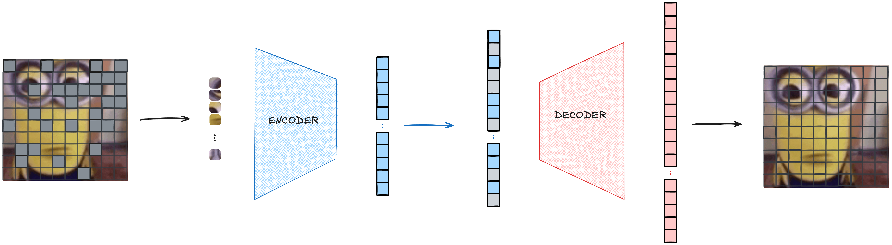

Imaginá intentar aprender un idioma viendo solo el 25% de cada oración. Suena como una idea terrible, ¿no? 

Bueno, resulta que esto es exactamente lo que hacen los Vision Transformer Masked Autoencoders (ViT-MAE) con las imágenes. El paper "Masked Autoencoders Are Scalable Vision Learners" de He et al. mostró algo bastante loco: si ocultás el 75% de una imagen (dividiéndola en parches y enmascarando aleatoriamente el 75% de ellos) y le pedís a un modelo que la reconstruya, obtenés representaciones visuales sorprendentemente poderosas. 


## Arquitectura General

ViT-MAE tiene tres componentes principales: patchificación, una arquitectura asimétrica encoder-decoder y una pérdida de reconstrucción. Vamos a ver cada uno en detalle.

El siguiente diagrama ilustra la arquitectura completa y el flujo de datos:


<br>
<small><b>Figura 1:</b> El flujo de la arquitectura ViT-MAE: (1) Imagen de entrada con el 75% de los parches enmascarados, (2) Los parches visibles se extraen y se pasan al encoder, (3) El encoder procesa solo los parches visibles para producir embeddings ricos, (4) Se agregan tokens de máscara para los parches faltantes, (5) El decoder reconstruye todos los parches incluyendo los enmascarados, (6) Imagen final reconstruida con todos los parches rellenados.</small>

### Patchificación: Convirtiendo Imágenes en Secuencias

Los Vision Transformers tratan las imágenes como secuencias de parches, similar a cómo los modelos de lenguaje tratan el texto como secuencias de tokens. Cada parche se convierte en un token al que el transformer puede atender. Acá te muestro cómo podés _patchificar_ una imagen en `pytorch`:

```python
def patchify(x: Tensor, p: int = 16) -> Tensor:
    batch, channels, height, width = x.shape
    assert height % p == 0 and width % p == 0
    unfold = nn.Unfold(kernel_size=p, stride=p)
    patches = unfold(x).transpose(1, 2)
    return patches
```

Para una imagen RGB de 224x224 con parches de 16x16, obtenemos 196 parches (grid de 14x14). Cada parche se aplana en un vector de tamaño $3 \times 16 \times 16 = 768$ dimensiones. La operación `Unfold` extrae estos parches eficientemente, y transponemos para obtener el formato de secuencia `[batch, num_patches, patch_dim]`.

La operación inversa, `unpatchify`, reconstruye la imagen a partir de los parches:

```python
def unpatchify(patches: Tensor, p: int = 16, height: int = 224, width: int = 224) -> Tensor:
    batch, num_patches, patch_size = patches.shape
    fold = nn.Fold(output_size=(height, width), kernel_size=p, stride=p)
    x = fold(patches.transpose(1, 2))
    return x
```

### Enmascaramiento Aleatorio: El Arte de Ocultar

La idea del enmascaramiento es literalmente tapar parte de la imagen al azar, como si agarraras post-its y los pegaras encima. Básicamente, tomamos todos los parches, mezclamos el orden y elegimos unos pocos para dejar visibles; el resto los tapamos:

```python
def random_masking(num_patches: int, keep_ratio: float = 0.25):
    perm = torch.randperm(num_patches)
    keep = perm[:int(num_patches * keep_ratio)]
    mask = perm[int(num_patches * keep_ratio):]
    restore = torch.argsort(perm)
    return keep, mask, restore
```

El truco está en `restore`: después de todo el lío de desordenar parches y ocultar unos cuantos, necesitamos devolver todo a su lugar original. El encoder solamente procesa los parches que dejamos destapados (`keep`), y el decoder tiene que "adivinar" cómo eran los tapados (`mask`) y volver a armar la secuencia como si nada. Por eso hace falta reordenar, así todo queda bien cuadradito al final. 

### Dando Sentido a lo Visible: Codificadores y Mecanismos de Atención

El codificador, en pocas palabras, es un Vision Transformer típico que solo ve los parches que quedaron sin tapar:

```python
class Encoder(nn.Module):
    def __init__(self, patch_dim=768, d_e=1024, depth=12, heads=16, npos=196):
        super().__init__()
        self.patch_embed = nn.Linear(patch_dim, d_e)
        self.pos_e = nn.Parameter(torch.zeros(1, npos, d_e))
        self.blocks = nn.ModuleList([TransformerBlock(d_e, heads) for _ in range(depth)])

    def forward(self, patches, visible_indices):
        tokens = self.patch_embed(patches) + self.pos_e[:, visible_indices, :]
        visible_tokens = tokens
        for block in self.blocks:
            visible_tokens = block(visible_tokens)
        return visible_tokens
```

Fijate que los embeddings posicionales solo los sumamos para los parches que están visibles, o sea, los que el codificador sí puede ver. Justamente esa es la gracia: con solo el 25% de los parches, el encoder tiene que arreglárselas y tratar de entender la textura, la estructura y en general el contexto visual de la imagen. Si lo pensás, el modelo está obligado a volverse bastante "vivo" para exprimir al máximo lo poco que ve.

Los bloques transformer en sí usan la típica atención multi-cabeza y un par de capas feed-forward, nada raro:

```python
class TransformerBlock(nn.Module):
    def __init__(self, d, heads=8, mlp_mult=4):
        super().__init__()
        self.pre_attention_norm = nn.LayerNorm(d)
        self.self_attention = MHSA(d, heads)
        self.pre_mlp_norm = nn.LayerNorm(d)
        self.feed_forward = MLP(d, mlp_mult)
    
    def forward(self, x):
        x = x + self.self_attention(self.pre_attention_norm(x))
        x = x + self.feed_forward(self.pre_mlp_norm(x))
        return x
```

Algo que siempre quise probar (pero todavía no me puse) es una variante llamada _Deformable Attention_. Básicamente la idea es que, en vez de que cada token mire a todos los demás (como pasa en atención estándar, que termina siendo carísimo cuando hay muchos tokens), le decís que solo preste atención a los $k$ tokens más relevantes. Es como pasar de un "todos contra todos" a un "solo miro a los importantes".

Normalmente, la atención completa implica que cada consulta calcula scores con todos los tokens (si tenés $n$ tokens, es una matriz de $n \times n$). Eso es potente pero pesado, sobre todo si la secuencia es larga.

En cambio, con Deformable Attention, cada token de consulta se conecta solo con $k$ tokens (y $k$ suele ser mucho menor que $n$), bajando la cuenta a $O(n \times k)$. La gracia es que el modelo aprende solito a elegir a cuáles mirar, y así queda un sistema mucho más eficiente, sin resignar tanta capacidad.

Fijate este diagrama:


<br>
<small><b>Figura 2:</b> Izquierda: atención completa (cada token mira a todos, la clásica matriz densa). Derecha: atención deformable con <i>k=4</i> (cada token solo mira a sus cuatro vecinos más útiles, y el patrón se adapta según la consulta). Así, podemos procesar imágenes grandes con menos recursos sin perder tanto en calidad.</small>

Del lado izquierdo, la atención completa es una marea de valores: cada consulta contra cada entrada (acá lo ves con una matriz $6 \times 6$). A la derecha, con deformable y $k=4$, cada consulta solo atiende a 4, formando una matriz mucho más liviana. Además, la ventana de atención puede correrse según cada token, porque el modelo aprende dónde conviene enfocarse.

Este método se vuelve especialmente útil cuando trabajás con imágenes grandes y la cantidad de parches se dispara. En algún momento lo voy a implementar para comparar frente al transformer clásico, seguro da para un buen experimento.
### Reconstruyendo lo Faltante: Mask Tokens y Recuperación de Píxeles

Acá es donde ocurre la magia de la reconstrucción: el decodificador. A diferencia del codificador, este módulo es más chiquito, con menos capas (por ejemplo, 8 en vez de 12) y un ancho menor (512 dimensiones vs 1024). ¿Por qué? Porque su laburo es más sencillo: agarrar las representaciones que salen del codificador y tratar de recuperar los valores de los píxeles originales.

```python
class Decoder(nn.Module):
    def __init__(self, d_embedd=1024, d_decoder=512, depth=8, heads=8, 
                 npos=196, patch_dim=768):
        super().__init__()
        self.proj = nn.Linear(d_embedd, d_decoder)
        self.mask_token = nn.Parameter(torch.zeros(1, 1, d_decoder))
        self.pos_d = nn.Parameter(torch.zeros(1, npos, d_decoder))
        self.blocks = nn.ModuleList([TransformerBlock(d_decoder, heads) for _ in range(depth)])
        self.head = nn.Linear(d_decoder, patch_dim)

    def forward(self, visible_embeddings, visible_indices, masked_indices, restore_indices):
        batch_size = visible_embeddings.size(0)
        projected_embeddings = self.proj(visible_embeddings)
        
        num_patches = len(visible_indices) + len(masked_indices)
        full_sequence = projected_embeddings.new_zeros(batch_size, num_patches, 
                                                        projected_embeddings.size(-1))
        
        # Ponemos los embeddings visibles en sus posiciones correspondientes
        full_sequence[:, visible_indices, :] = projected_embeddings
        
        # Ponemos el mask token (un vector aprendible) donde faltan parches
        full_sequence[:, masked_indices, :] = self.mask_token.expand(
            batch_size, len(masked_indices), -1)
        
        # Restauramos el orden espacial y sumamos los embeddings posicionales
        full_sequence = full_sequence[:, restore_indices, :] + self.pos_d
        
        decoder_input = full_sequence
        for block in self.blocks:
            decoder_input = block(decoder_input)
        
        return self.head(decoder_input)
```

En resumen, el decodificador se encarga de tomar:
- Los embeddings que sí vio el codificador
- Los mask tokens, que son como "placeholders" aprendibles para los parches tapados
- Los embeddings posicionales, para recordar dónde va cada cosa

El mask token es simplemente un vector aprendible — uno solo — que se copia todas las veces necesarias para tapar los huecos. Gracias a la atención del decodificador, estos mask tokens pueden mirar a los patches visibles y a los otros mask tokens, aprendiendo así a completar lo que falta en la imagen.


### La Pérdida: Aprendiendo lo que Importa

La pérdida del modelo solo se fija en los parches de la imagen que fueron tapados, no en los que ya veía. Esto es re importante: si también le sumáramos la pérdida de los visibles, el modelo podría simplemente copiarlos tal cual y no aprendería nada útil.

```python
def mae_loss(pred, target_patches, mask_idx, norm_pix_loss=True):
    if norm_pix_loss:
        # Normalizamos cada parche usando su propia media y varianza
        mean_target = target_patches[:, mask_idx, :].mean(dim=-1, keepdim=True)
        var_target = target_patches[:, mask_idx, :].var(dim=-1, keepdim=True, unbiased=False)
        norm_target = (target_patches[:, mask_idx, :] - mean_target) / (var_target + 1e-6).sqrt()
        
        mean_pred = pred[:, mask_idx, :].mean(dim=-1, keepdim=True)
        var_pred = pred[:, mask_idx, :].var(dim=-1, keepdim=True, unbiased=False)
        norm_pred = (pred[:, mask_idx, :] - mean_pred) / (var_pred + 1e-6).sqrt()
        
        return ((norm_pred - norm_target) ** 2).mean()
    else:
        return ((pred[:, mask_idx, :] - target_patches[:, mask_idx, :])**2).mean()
```

Ese `norm_pix_loss` lo que hace es normalizar cada parche antes de calcular el error, así el modelo no se distrae con diferencias de brillo o color y se concentra en aprender la estructura de la imagen. Básicamente, en vez de pedirle que acierte el color exacto de una casa, le estamos pidiendo que entienda la forma y el patrón general.


## Por Qué Esto Funciona

¿Por qué funciona tan bien ViT-MAE? Pensalo así: es como si te dieran un rompecabezas de 1000 piezas, pero solo te dejaran ver 250. No podés simplemente copiar lo que ves, tenés que adivinar y entender cómo encajan las partes que faltan. El modelo está obligado a captar el sentido general de la imagen, no pueden hacer trampa porque no hay de dónde copiar.

La clave está en esta división de roles: el codificador (encoder) es el que de verdad piensa y trata de entender la info limitada que recibe. El decodificador es mucho más simple y solo ayuda a reconstruir la imagen al final. Durante el entrenamiento, usamos ambos. Después, solo nos quedamos con el codificador, que es el que aprendió realmente a “ver”.

A diferencia de otros métodos más complejos, como el aprendizaje contrastivo, acá la consigna es directa: “Reconstruí lo que falta”. Los transformers son perfectos para esto porque se la bancan entendiendo relaciones entre partes de la imagen, incluso si la mayoría fue ocultada. Por eso, el modelo aprende representaciones visuales poderosas, a pesar de que se le oculta casi todo.


## Poniéndolo Todo Junto

Así sería el "forward" entero del modelo ViT-MAE:

```python
class ViTMAE(nn.Module):
    def forward(self, x):
        # 1. Convertimos la imagen en parches
        patches = patchify(x, self.patch_size)
        
        # 2. Elegimos aleatoriamente qué parches dejar visibles y cuáles tapar
        keep, mask, restore = random_masking(self.num_patches, self.keep_ratio)
        keep = keep.to(x.device)
        mask = mask.to(x.device)
        restore = restore.to(x.device)

        # 3. Solo los parches visibles pasan por el encoder
        visible_patches = patches[:, keep, :]
        visible_embeddings = self.encoder(visible_patches, keep)
        
        # 4. El decoder trata de reconstruir todos los parches (los visibles y los tapados)
        reconstructed_patches = self.decoder(visible_embeddings, keep, mask, restore)
        
        return reconstructed_patches, patches, mask
```

En el entrenamiento, la gracia está en comparar la reconstrucción con los parches tapados (no con todos), sacar la pérdida, y hacer el backpropagation como siempre. Al final, el encoder aprende a sacar el jugo clave de imágenes medio ocultas, y eso después sirve un montón para tareas como clasificación, detección o segmentación, aunque no haya visto la mayoría de la imagen durante el pre-entrenamiento.


## El Panorama General

En resumen, ViT-MAE es una idea tan simple que hasta parece absurda: tapá gran parte de la imagen y pedile al modelo que adivine el resto. Y resulta que eso lo obliga a aprender en serio, entendiendo la estructura y el significado de las imágenes, sin que nadie le diga qué es qué.

Este método, por más raro que suene, funcionó tan bien que inspiró un montón de variantes: desde MAE para video hasta mezclas con texto y otros dominios. Los investigadores siguen probando cómo ocultar cosas para que los modelos aprendan mejor. Pero si lo pensás, el truco no cambia: escondé lo suficiente como para que el modelo no pueda hacer trampa, y dejá que resuelva el rompecabezas con lo poco que tiene. Si logra reconstruir una imagen a partir de solo un cuarto de los datos, está claro que entendió mucho más de lo que parece.

Así que, quién te dice, la próxima vez que te quieras desafiar de verdad, probá tapar parte del problema. Si funciona para los transformers, capaz te sorprende a vos también.

